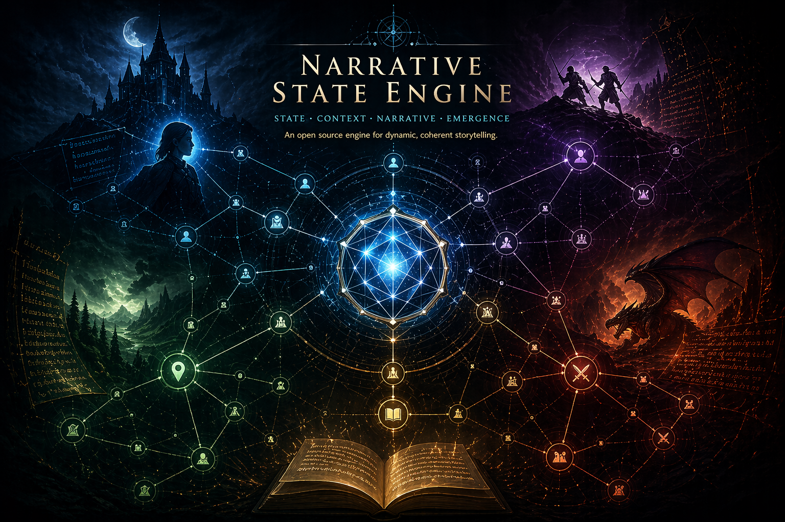

# narrative-state-engine

<p align="center">
  
</p>

A player-side assistant framework for AI-driven RPG and interactive fiction sessions.

This system captures DM responses and player prompts, preserves full transcripts, extracts structured narrative state, maintains catalogs and storyline continuity, tracks player objectives, analyzes strategy, and generates suggested next player prompts.

**This is NOT a DM engine.** It supports the player interacting with an external AI DM.

---

## Purpose

Given a sequence of DM outputs and player prompts, the system:

1. Preserves the exact transcript (immutable source)
2. Maintains a structured understanding of the narrative state
3. Tracks player objectives (short-term and long-term)
4. Identifies evidence, inference, and possible DM bait
5. Infers DM behavior patterns over time
6. Analyzes the current situation
7. Suggests multiple candidate player prompts

---

## Repository Structure

```
README.md
LICENSE
.github/copilot-instructions.md

docs/
  architecture.md
  usage.md
  roadmap.md
  semantic-extraction-design.md
  design-catalog-v2.md
  Extraction-Lessons.md
  idea-discussion.md

config/
  llm.json                     # LLM provider settings (model, endpoint)

schemas/
  turn.schema.json
  entity.schema.json
  entity-index.schema.json
  plot-thread.schema.json
  state.schema.json
  objective.schema.json
  evidence.schema.json
  prompt-candidate.schema.json
  dm-profile.schema.json
  event.schema.json
  session-events.schema.json
  timeline.schema.json
  season-summary.schema.json
  metadata.schema.json
  anomaly.schema.json
  turn-context.schema.json

framework/
  catalogs/
    characters.json              # V1 flat files (legacy; V2 uses per-entity subdirs)
    locations.json
    factions.json
    items.json
    events.json
    anomalies.json
    plot-threads.json
  objectives/
    objectives.json
  dm-profile/
    dm-profile.json
  story/
    summary.md
    world-state.md
    session-index.json           # Index of all sessions for cross-session queries
  strategy/
    heuristics.md
    hint-interpretation.md
    manipulation-patterns.md
    risk-model.md

sessions/
  session-001/
    metadata.json
    transcript/
      turn-001-player.md
      turn-002-dm.md
    raw/
      full-transcript.md
    derived/
      turn-summary.md
      state.json
      objectives.json
      evidence.json
      next-move-analysis.md
      prompt-candidates.json
      session-events.json        # Mechanical events (HP, items, spells, level-ups)
      timeline.json              # Temporal markers and season transitions
      season-summaries.json      # Structured season summary blocks
    exports/
      book-skeleton.md           # Fiction/book outline placeholder (scaffolded by bootstrap_session.py; intended for future export_book_skeleton.py output)

templates/
  extraction/
    entity-discovery.md          # LLM prompt templates for semantic extraction
    entity-detail.md
    relationship-mapper.md
    event-extractor.md
  content/
    character-sheet.md           # Copilot-assisted content authoring templates
    faction-sheet.md
    location-sheet.md
    storyline-sheet.md
  dm/
    adversarial-dm.md            # DM-style prompt templates for testing
    generic-rpg.md
    generic-freeform.md
  prompts/
    ingest-session-turn.md       # Copilot prompt templates for common tasks
    next-move-analysis.md
    resume-analysis.md
    rpg-to-book-outline.md

tools/
  bootstrap_session.py           # Import an existing transcript into a session
  ingest_turn.py                 # Add a new turn to a session
  update_state.py                # Regenerate derived scaffolds and turn summary
  analyze_next_move.py           # Generate next-move analysis and prompt candidates
  validate.py                    # Validate JSON files against schemas
  semantic_extraction.py         # LLM-based entity/relationship/event extraction
  catalog_merger.py              # Merge extracted data into framework catalogs
  llm_client.py                  # Provider-agnostic LLM client wrapper
  build_context.py               # Build focused per-turn entity context
  extract_structured_data.py     # Extract inline game markers and temporal events
  generate_wiki_pages.py         # Generate markdown wiki pages from V2 entity files
  migrate_catalogs_v2.py         # One-time V1→V2 catalog layout migration
  synthesis.py                   # Data foundation for wiki synthesis: event grouping, phase segmentation, relationship arc summarization
  narrative_synthesis.py         # LLM-powered narrative wiki page generation (LLM calls and page assembly)
  export_book_skeleton.py        # Generate book/fiction outline (placeholder)

examples/
  demo-session/
```

---

## Quick Start

### Prerequisites

- Python 3.10+
- No external dependencies required for core tools
- **Optional** — for LLM-based semantic extraction: `pip install -r requirements-llm.txt`
  - Works with OpenAI API or any OpenAI-compatible endpoint (e.g. Ollama)
  - Configure provider/model in `config/llm.json`

### Ingesting a Turn

After each exchange with your AI DM, add the turn to a session:

```bash
# Add a DM response (turn 003)
python tools/ingest_turn.py \
  --session sessions/session-001 \
  --speaker dm \
  --text "The innkeeper leans forward and whispers: 'The old tower has been sealed for twenty years. Those who enter do not return.'"

# Add a player prompt
python tools/ingest_turn.py \
  --session sessions/session-001 \
  --speaker player \
  --text "I ask the innkeeper if anyone has tried to investigate the tower recently."
```


### Bootstrapping From an Existing Transcript

If you already have a large transcript, import it in one step:

Put the source text in a local-only folder that is gitignored:

```bash
mkdir -p sessions/_import
# Place your raw transcript text at:
# sessions/_import/session-001-full-transcript.txt
```

```bash
python tools/bootstrap_session.py \
  --session sessions/session-001 \
  --file sessions/_import/session-001-full-transcript.txt
```

Use `--dry-run` first to preview parsed turns and writes.

### Updating State

After ingesting new turns, refresh the derived scaffold and summary:

```bash
python tools/update_state.py --session sessions/session-001
```

Current automated behavior:
- Rebuilds `sessions/session-001/derived/turn-summary.md` from transcript files
- Creates scaffold files if missing: `state.json`, `objectives.json`, `evidence.json`
- Updates `state.json.as_of_turn`
- Extracts inline game markers into `session-events.json` (HP changes, item acquisitions, spell use, level-ups)
- Extracts temporal markers into `timeline.json` (season transitions, time progression)
- Extracts season summary blocks into `season-summaries.json`

### Semantic Extraction (Optional)

If an LLM is configured (`config/llm.json`), `bootstrap_session.py` automatically runs semantic extraction across all turns to populate `framework/catalogs/` with entities, relationships, and events.

For incremental ingestion, pass `--extract` to `ingest_turn.py`:

```bash
python tools/ingest_turn.py \
  --session sessions/session-001 \
  --speaker dm \
  --text "..." \
  --extract
```

See [`docs/semantic-extraction-design.md`](docs/semantic-extraction-design.md) for pipeline details.

### Building Per-Turn Entity Context

Build a focused entity snapshot for a specific turn (prefers the V2 catalog layout, but falls back to V1 flat files via format detection):

```bash
python tools/build_context.py \
  --session sessions/session-001 \
  --turn turn-003 \
  --framework framework/
```

Produces `sessions/session-001/derived/turn-context.json` containing the entities mentioned in the turn, their one-hop active relationships, and a summary of recently updated nearby entities.

### Migrating Catalogs to V2 Layout

The catalog system supports two layouts:

- **V1** — flat JSON files (`characters.json`, `locations.json`, etc.) — original format
- **V2** — per-entity subdirectories (`catalogs/characters/<id>.json`, etc.) with `index.json` per type — enables efficient per-turn context loading and wiki page generation

To migrate an existing V1 framework to V2:

```bash
python tools/migrate_catalogs_v2.py --framework framework/
```

Use `--force` to overwrite an existing V2 layout. Most catalog-reading tools support both layouts with automatic format detection, but some tools are intentionally V2-only or strict about V2 input. In particular, `tools/generate_wiki_pages.py` requires the V2 per-entity layout, and `tools/validate.py` will flag V1 entity catalogs as errors rather than validating them against the V2 entity schema.

### Generating Wiki Pages (V2 only)

Generate human-readable markdown wiki pages from V2 per-entity catalog files:

```bash
python tools/generate_wiki_pages.py --framework framework/
# Or limit to one entity type:
python tools/generate_wiki_pages.py --framework framework/ --type characters
```

For LLM-powered narrative synthesis (requires LLM config):

```bash
# LLM-powered narrative synthesis (requires LLM config):
python tools/generate_wiki_pages.py --framework framework/ --synthesize
# Force full regeneration:
python tools/generate_wiki_pages.py --framework framework/ --synthesize --force
```

Produces individual `.md` pages alongside each entity JSON file and `README.md` index pages per entity type directory.

### Generating Next-Move Analysis

Analyze the current situation and generate prompt candidates:

```bash
python tools/analyze_next_move.py --session sessions/session-001
```

### Validating JSON Files

Check that all JSON files conform to their schemas:

```bash
python tools/validate.py --session sessions/session-001
python tools/validate.py --framework framework
```

---

## Using with VS Code Copilot

This repository is configured for GitHub Copilot via `.github/copilot-instructions.md`.

**Recommended workflow:**

1. Open the session folder in VS Code.
2. Add turns with `tools/ingest_turn.py` (or use `tools/bootstrap_session.py` for existing transcripts).
3. Run `tools/update_state.py` to regenerate `turn-summary.md` and ensure derived scaffolds exist.
4. Ask Copilot to update `derived/state.json`, `derived/objectives.json`, and `derived/evidence.json`.
5. Run `tools/analyze_next_move.py` and refine prompt candidates as needed.
6. Copilot will follow the instructions in `.github/copilot-instructions.md` to ensure consistency.

**Example Copilot prompts:**

- "Update `derived/state.json`, `derived/objectives.json`, and `derived/evidence.json` based on the latest DM turn."
- "Generate 3 prompt candidates focused on the current main objective."
- "What evidence do we have for the tower being cursed vs. just abandoned?"

---

## Design Principles

1. **Raw is immutable** — original transcript text is never modified
2. **Derived is reproducible** — all summaries and state are derived from raw data
3. **Turn-based structure** — session is a sequence of turns; each turn may produce derived updates
4. **Catalog-first context** — agents load summaries and catalogs instead of full transcripts
5. **No assumed game system** — the system learns from the transcript
6. **Player-assistant focus** — helps interpret hints, detect traps, plan strategy, generate prompts
7. **Keep v1 simple** — no unnecessary abstractions

---

## Evidence Classification

All analysis distinguishes:

| Classification | Meaning |
|---|---|
| `explicit_evidence` | Directly stated by the DM |
| `inference` | Derived conclusion — may be wrong |
| `dm_bait` | Possible trap or narrative lure |
| `player_hypothesis` | Tentative idea not yet supported |

**Never present inference as fact.**

---

## Objective Types

| Type | Description |
|---|---|
| `strategic_long_term` | High-level goals spanning multiple sessions |
| `tactical_short_term` | Immediate goals for the current situation |

---

## See Also

- [`docs/architecture.md`](docs/architecture.md) — system design and data flow
- [`docs/usage.md`](docs/usage.md) — detailed usage guide
- [`docs/roadmap.md`](docs/roadmap.md) — development phases and status
- [`docs/semantic-extraction-design.md`](docs/semantic-extraction-design.md) — LLM extraction pipeline design
- [`docs/design-catalog-v2.md`](docs/design-catalog-v2.md) — V2 catalog entity state model and context builder design
- [`docs/Extraction-Lessons.md`](docs/Extraction-Lessons.md) — lessons learned from large extraction runs
- [`examples/demo-session/`](examples/demo-session/) — a worked example session
