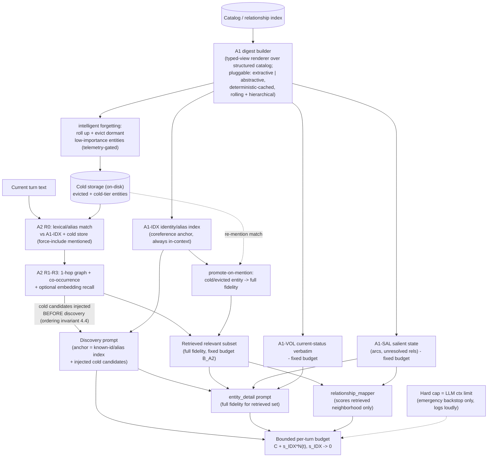

# Bounded Per-Turn Context Architecture (A1 + A2) — Design Report

**Status**: Design (pre-implementation). Architectural design-first artifact for the token-stabilization
epic (#477).
**Builds on**: `docs/design-token-stabilization.md` (PR #478) — the per-phase/per-lever token decomposition
of the same baseline run. This document assumes that decomposition and does not re-derive it; it cites the
measured numbers and extends them with an **architecture** that targets *bounded* per-turn growth, which the
PR #478 levers (L1/L2/L4) explicitly do **not** achieve on their own.
**Baseline run**: `eval-qwen36-344t-full` (344-turn full extraction, qwen3.6).
**Audience**: `@developer` (mechanism), `@quality-analyst` (coreference + fidelity review), `@model-optimizer`
(parameter interaction), `@extraction-specialist` (measurement / A/B).

> **Every projected token number in this document is an `[ESTIMATE]`** with its assumptions stated inline.
> Measured ground truth is drawn only from PR #478 / `eval-qwen36-344t-full` and is labelled MEASURED.
> The future *measured* A/B results should overwrite/compare against these estimates.
>
> **Central-claim status `[HYPOTHESIS — falsifiable]` (not `[ESTIMATE]`, not a result).** The word "bounded"
> in this document means **bounded-in-the-limit, conditional on the active identity set `N_active` converging
> to a constant** — and that convergence is **UNPROVEN over the only window we have measured (344 turns)**.
> What the data *does* support is **"much flatter and cheaper"**, not "asymptotically bounded": a **~19×
> flatter slope** (88.62 → ~4.63 tok/turn) and a **~70% per-turn reduction** on the 344-turn offline replay.
> A flatter line is **not** an asymptote, and that replay **excluded A1/A2 build/maintenance costs**. The
> asymptotic-bound claim is therefore a **falsifiable hypothesis**, settled only by the long-run accounting in
> [§5.6 Falsification gates](#56-falsification-gates) and [§9](#9-phasing-spike-and-ab). Appendix A marks the
> bound claim `[HYPOTHESIS — falsifiable]` accordingly.

---

## Table of Contents

1. [Problem Restatement — why the levers halve but do not bound](#1-problem-restatement)
2. [Rejecting A3 (per-phase hard caps) as a stabilization strategy](#2-rejecting-a3)
3. [A1 — Bounded summary-based running state](#3-a1-bounded-summary-based-running-state)
4. [A2 — Retrieval-scoped high-fidelity injection](#4-a2-retrieval-scoped-injection)
5. [Complementarity — how A1 and A2 cover each other's blind spots](#5-complementarity)
6. [Coreference safety — the make-or-break property](#6-coreference-safety)
7. [Relationship to existing levers (L1/L4/L2)](#7-relationship-to-existing-levers)
8. [Quality risks and mitigations](#8-quality-risks-and-mitigations)
9. [Phasing, spike plan, and the long-run A/B requirement](#9-phasing-spike-and-ab)
10. [Learn-as-you-go — telemetry-driven decisions](#10-learn-as-you-go--telemetry-driven-decisions)
11. [Alternatives considered & rejected; named spikes](#11-alternatives-considered--rejected-named-spikes)

---

## 1. Problem Restatement

### 1.1 The runaway (MEASURED, from PR #478)

Per-turn total input tokens across the four extraction phases fit a clean, **unbounded** straight line over
the 344-turn run:

$$\text{total\_input\_tokens}(t) = 15182 + 88.62 \cdot t \qquad (\text{MEASURED, linear fit, } n=374)$$

(Here `n=374` is the number of per-turn token **samples** in the fit, not the turn count: the 344-turn run
plus a 30-turn re-extraction pass = 374 measured points. The slope/intercept are unchanged by this; `n`
labels the regression sample size, not the session length.)

There is no plateau. A late turn costs ~2.5x an early turn (17,122 mean at t<=30 -> 43,084 mean at t>=300)
for the **same** per-turn narrative work. The driver is the `entity_detail` phase (**64.4%** of load at
scale) plus `relationship_mapper` (16.0%) plus the discovery known-entities block (12.7%). The sub-drivers,
each cited to the pipeline:

- **Detail-call count growth.** More entities get detailed as the catalog grows; capped at 6 by
  `_MAX_DETAIL_ENTITIES_PER_TURN = 6` ([tools/semantic_extraction.py](../tools/semantic_extraction.py#L1161)).
  The cap drops candidates (262 capped across the run) but does **not** flatten the curve up to the cap.
- **Uncapped PC relationship web.** `char-player` carries **109 active / 0 resolved** relationships at t344
  and re-serializes the entire web on every PC detail call, because `_format_prior_entity_context`
  ([tools/semantic_extraction.py](../tools/semantic_extraction.py#L1498-L1610)) applies arc-compaction to the
  PC but **not** the mention/recency filter nor the `_SCENE_MAX_RELATIONSHIPS = 8` cap
  ([tools/semantic_extraction.py](../tools/semantic_extraction.py#L1158)) that non-PC entities receive.
- **Per-call template repetition.** ~15K/turn is re-sent template+turn boilerplate across ~8.9 calls/turn
  (orthogonal slice; the L2 target).
- **Discovery known-entities block.** Grows with catalog size; built by `format_known_entities_bounded`
  ([tools/catalog_merger.py](../tools/catalog_merger.py#L676)) and injected at
  ([tools/semantic_extraction.py](../tools/semantic_extraction.py#L2818)). This block is the **coreference
  anchor** (Section 6).

### 1.2 Why L1/L4/L2 only halve the slope

PR #478 Section 4.3 is explicit and this design accepts its verdict: L1 (PC type-tiered cap), L4 (relmap
budget tiering), and L2 (batch entity_detail) attack **per-entity size**, **per-call repetition**, and **one
phase's budget** — they reduce the *coefficient* on each slice but every one of them still scales with the
**count of active entities/relationships** the turn must consider. The projected residual after L1+L4+L2 is
**~25-40 tok/turn** (down from 88.62), still **linear, still unbounded**, dominated by:

1. the discovery known-block growing with catalog size, and
2. irreducible per-entity content growth.

**The structural problem the levers cannot touch:** per-turn context size is *coupled to catalog size*. As
long as "what we inject this turn" is some function of "everything we know," the turn cost grows with the
session. **Bounding requires decoupling per-turn context size from catalog size** — injecting an amount of
context that is a function of *this turn's needs* plus a *fixed-size background*, not of the accumulated
total. That decoupling is the entire purpose of A1 + A2.

---

## 2. Rejecting A3

**A3 (per-phase hard token caps) is REJECTED as the stabilization strategy.**

PR #478 listed A3 as a candidate architectural lever ("clamp each phase to a fixed ceiling and let the budget
allocator drop lowest-priority content"). The human's steer rejects it, and this design adopts that
reasoning verbatim:

> A hard cap specifies only *that* you stay within a number, never *how*. "Just trim whatever is beyond the
> cap" makes the engine dumb: it pushes the hard decision (which information is worth keeping) onto a blind
> truncation step. The only legitimate hard cap is the **LLM's own token limit** — a physical constraint.
> Long before that limit, we must **intelligently reduce consumption**, choosing *what* to include by
> relevance and *what* to summarize by salience. A cap is an **emergency backstop at the context-window
> limit**, not a stabilization mechanism.

Concretely, A3-as-strategy fails on the property that matters most here: it has **no model of coreference
safety.** A blind per-phase cap that drops the lowest-priority entries from the discovery known-block removes
exactly the identity anchors whose loss causes duplicate re-extraction (Section 6) — this is the same failure
mode that got #468's catalog trimming rejected. A cap does not know that an identity line is cheap and must
never be dropped, while a verbose relationship history is expensive and *can* be summarized.

**Disposition of caps in this design:** retain a hard per-phase ceiling **only** as a safety backstop pinned
near the model context window (e.g. each phase prompt must not exceed `context_length - response_headroom`).
If a prompt would breach it, that is a *bug in the A1/A2 budgets* to be fixed, not a routine trimming event.
The backstop should **log loudly** when engaged, never silently. The intelligent reduction — A1 summarization
+ A2 retrieval — runs far below the backstop and is what actually keeps us bounded.

---

## 3. A1 — Bounded Summary-Based Running State <a id="3-a1-bounded-summary-based-running-state"></a>

### 3.1 Definition

A1 replaces the **append-only full-catalog / full-relationship serialization** with a **bounded running state
digest** that is *maintained* (updated in place, rolled up) rather than *re-listed* in full — and that
actively **forgets** (rolls up and then evicts) dormant low-importance entities (Section 3.4). The digest has
three compartments, each with its own budget and refresh discipline:

> **A1 is a typed-view renderer over the structured catalog NSE already persists — not a free-text memory.**
> This is the framing the design commits to. The source of truth stays the **existing structured store**
> ([framework/catalogs/relationship-index.json](../framework/catalogs/relationship-index.json),
> [framework/catalogs/scene-graph.json](../framework/catalogs/scene-graph.json), and the per-entity JSON
> records). A1 does not invent a parallel prose memory; it **renders bounded, typed, query-specific *views***
> over that structured data — an identity-index view (A1-IDX), a salient-state view (A1-SAL), a
> current-status view (A1-VOL). The shipping **extractive default (Section 3.1, pluggable backend) is exactly
> a typed-view renderer**: a deterministic projection of fields NSE already stores, with prose appearing only
> at the prompt boundary. The optional abstractive backend summarizes those same typed records; it never
> becomes the system of record. This keeps identity, diffability, duplicate detection, and update semantics
> structural, and confines summary-error risk to a rendering layer that can always be re-derived from the
> catalog.

| Compartment | Content | Budget `[ESTIMATE]` | Refresh cadence | Bounded by |
|---|---|---:|---|---|
| **A1-IDX** Identity index | One ultra-compact line per known entity: `id \| primary-name \| aliases \| type \| 1-line role`. The **coreference anchor**. | **17 / 19 / 25 tok/entity** (p50 / in-context avg / p90, MEASURED F3); ~5.8K (p50) / 8.6K (p90) at N=344 | Append on new entity; edit on alias/identity change | Hierarchical rollup **and intelligent forgetting** of dormant entities (3.4) |
| **A1-SAL** Salient state | Permanent / high-salience facts: open arcs, **unresolved** relationships, durable stable_attributes, long-range callbacks. | fixed ~2,500 | Rolling: every N turns, or on arc/relationship status change | Salience ranking + fixed cap |
| **A1-VOL** Volatile current-status | The *current* status line for entities touched recently, kept **verbatim** (not summarized). | fixed ~1,500 | Every turn for touched entities | Recency window |

**Total A1 budget `[ESTIMATE]`:** `B_A1 = B_IDX + ~4,000`. Everything except `B_IDX` is a fixed budget
independent of session length. `B_IDX` is the single residual catalog-coupled term, and it is the
**cheapest possible** per-entity cost (an identity line, not a relationship web) — see Section 5.4 for why
this is the right place to concentrate the residual, and 3.4 for how intelligent forgetting bounds it too.

> **Alias note (MEASURED F3, CORRECTED).** An earlier reading of this spike reported `alias=null` for all
> entities — that was a **measurement artifact**: the spike script read a non-existent top-level `aliases`
> key instead of the real nested path `stable_attributes.aliases.value`. **Re-measured correctly, aliases ARE
> populated:** 15 of the 122 entities (12.3%) in the F3 corpus carry aliases (e.g. the player's alias
> "Fenouille"; in the `b70-full-a` run "Lyrawyn" carries 4), so the alias-based coreference path **is**
> exercised by real data. Because alias coverage is sparse (mean ~0.22 aliases/entity overall; ~1.8 on the
> aliased 12.3%) and cheap (**~1.83 tok/alias** measured), including the real aliases leaves the per-entity
> p50/p90 **unchanged at 17 / 25**; only the tail rises (p99 29.8 -> 32, max 32 -> 34, mean 18.0 -> 18.5).
> **Pre-A1b validation (§9.1):** confirm alias **coverage and quality** in the live pipeline (not mere
> existence) before A1b's cold/eviction tiers rely on the alias-based coreference path. See §5.4.

**These budgets are TARGET ENVELOPES with typed non-droppable invariants — NOT silent caps.** This is the
property that distinguishes A1-SAL/A1-VOL (and the A2 budget, Section 4.3) from the **rejected A3 hard caps**
(Section 2): a fixed number alone, enforced by "rank and drop the overflow," *is* A3 by another name. To avoid
that, every budget here carries an explicit **priority type system** with invariants that overflow may never
violate:

| Priority class | Examples | Droppable on overflow? |
|---|---|---|
| **P0 — identity anchors** | `id \| primary-name \| type` line for every entity in the working set | **NEVER** |
| **P0 — mentioned-entity current status** | current_status / status_updated_turn for any entity mentioned this turn | **NEVER** |
| **P1 — active arcs & unresolved relationships** | open-arc participants, unresolved-relationship targets | Only after a rolled summary line exists |
| **P2 — relationship history** | superseded snapshots, resolved-relationship history | Droppable (already rolled) |

When a dense turn would push A1-SAL, A1-VOL, or A2 past its envelope, the system drops **only P2 (then P1
*after* its rolled summary is written)** and **emits LOUD overflow / degraded-mode telemetry** — never a silent
truncation. A P0 invariant breach is a **failure event** (alarmed, treated as a budget bug per Section 2), not
a routine trim. This is what makes the envelopes safe where a blind cap is not: the engine knows an identity
anchor is cheap and non-negotiable, while relationship history is expensive and droppable *only once
summarized*.

**Pluggable digest backend (build-for-both).** The function that condenses history into A1-SAL (and the
rolled summary lines in A1-IDX/A1-VOL) is a **pluggable backend** with two interchangeable implementations:
a deterministic **extractive** digest (sort + truncate + rolled summary lines) and an **LLM-abstractive**
digest (a model condenses history). This design does **not** commit to either method upfront — there are too
many unknowns. Both are built and **compared empirically** with quality + token telemetry (Section 10); the
extractive backend is the shipping **default** for temperature-0 byte-stability and zero extra model calls.

### 3.2 What is summarized vs kept verbatim

The cardinal rule (mirrors the L1 quality lesson and PR #478 Section 8): **summarize stable history; keep
volatile current-status verbatim.**

- **Kept verbatim (never summarized):** identity, aliases, current_status, status_updated_turn, open arcs,
  unresolved-relationship targets. These are the facts that, if blurred, produce *wrong current state* or
  *broken coreference*. They are also individually cheap.
- **Summarized (hierarchical / rolling):** relationship *history* lists, superseded volatile snapshots, and
  resolved relationships. The pipeline already has the primitives — `_build_volatile_digest`,
  `_compact_relationships_with_arcs`, and arc-aware compaction in
  [_format_prior_entity_context](../tools/semantic_extraction.py#L1498-L1610). A1 *promotes* these from
  per-call, per-entity local compaction into a **persisted, maintained** digest so the work is done once and
  carried, not recomputed and re-expanded every call.

### 3.3 Why "bounded" requires rolling/hierarchical summarization, not append-only

A naive "summary" that simply *appends* a one-line summary per entity per arc re-creates the runaway with a
smaller constant — it is still O(session). A1 is bounded only if summarization is **hierarchical and
rolling**:

- **Rolling within an entity:** when an entity accrues its (k+1)-th history entry, the oldest entries are
  folded into a single rolled summary line, so per-entity salient state is capped at a fixed size regardless
  of how many turns the entity has lived through. (Generalization of the existing
  `_ARC_AWARE_MAX_VOLATILE_SNAPSHOTS = 3` and PC volatile digest.)
- **Hierarchical across entities:** see 3.4.

### 3.4 Intelligent forgetting — bounding A1-IDX by evicting dormant entities

`B_IDX` is the single residual catalog-coupled term (`s_IDX · N(t)`, Section 5.3). Hot/cold compression alone
only *slows* its growth; to truly **bound** it we must be willing to **forget** — to stop paying context for
entities that no longer matter. This is a **first-class design element**, not an afterthought.

> **Eviction is THE central boundedness-vs-quality tradeoff of this entire design — not telemetry-gated
> cleanup.** The asymptotic-bound *hypothesis* (the doc's headline claim) lives or dies here: without
> eviction, `B_IDX` stays catalog-coupled and nothing is bounded; *with* aggressive eviction, identity
> corruption (#468-style duplicate/splinter) returns. The risk is **fundamentally asymmetric**: a **false
> keep costs only tokens** (a recoverable, linear waste), but a **false evict can CORRUPT identity or state**
> (a re-mention mints a duplicate, an arc loses its anchor — a correctness failure, not a cost failure). The
> two error directions are therefore **not** trade-off-symmetric, and the policy must be tuned with that
> asymmetry front and center.
>
> **Every importance signal we have is a PAST-salience proxy that cannot guarantee FUTURE narrative
> salience.** Mention recency, mention count, graph centrality, and arc/key-plot flags all describe how
> important an entity *has been*; narratives routinely reintroduce a low-mention clue, a one-off NPC, a stale
> debt, a wound, a rumor, or a place name as a late callback that *becomes* important. If the catalog itself
> never flagged the object as key-plot, **no heuristic here can know it will matter** — that is a structural
> limit, not a tuning gap. Eviction is consequently the design's most quality-sensitive knob; **threshold
> tuning stays telemetry-gated (Section 10), but the framing is action-now and load-bearing**, and the entire
> eviction tier is gated behind the zero-new-duplicate A/B before it ships.

**The motivating case.** "Animal bones" are noted around camp at turns 15-18 and then never recur for 300+
turns. Keeping a full identity line (and its aliases, history) in context for the next several in-game *years*
is pure waste: that entity is neither **quantitatively important** (very low mention count, near-zero graph
centrality) nor **semantically important** (not a permanent-bond entity like the PC's companion, not a
key-plot entity like a recurring antagonist or a quest object). It should be **rolled up and then evicted**
from the active index. We should not pay context for camp bones years later.

**Forgetting as a tiered rollup, ending in eviction.** The index ages each entity through tiers, and the tier
boundaries are **telemetry-gated, not a hardcoded rule**:

| Tier | State | Cost | Trigger (telemetry-driven) |
|---|---|---:|---|
| Hot (verbatim) | full `id \| name \| aliases \| role` line | ~17-25 tok (p50-p90, MEASURED F3) | mentioned/active within the recency window |
| Cold (compressed) | `id \| primary-name \| type`; aliases moved to a cold-storage lookup | ~6-8 tok | dormant > M turns **and** not flagged important |
| Cluster rollup | very large cold cohorts (e.g. a defunct faction's rank-and-file) collapse to one cluster line + count | ~O(1)/cohort | many co-dormant low-importance entities |
| **Evicted** | dropped from the active index entirely; retained only in cold storage on disk | **0 tok** | dormant beyond the eviction horizon **and** low quantitative **and** low semantic importance |

**Eviction is reversible (promote-on-mention).** Eviction is never destructive: an evicted entity remains in
persisted cold storage. A2's lexical/embedding match against cold storage (Section 4.2) **promotes the entity
back to hot** the instant it is re-mentioned, restoring its identity line and full fidelity for that turn. So
forgetting is a context-cost optimization, not data loss, and it stays **coreference-safe**: a re-mention
resolves to the *existing* ID rather than minting a duplicate.

**Importance is measured, not declared.** Whether an entity is "important enough to keep" is decided by
**telemetry signals**, never a static word list (consistent with the project's no-hardcoded-lists rule):

- **Mention recency** — turns since last seen.
- **Quantitative importance** — cumulative mention count and graph **centrality** (degree in the relationship
  index).
- **Semantic importance** — membership in protected classes derived from the catalog's *own* structure:
  permanent-bond relationships, open-arc participants, key-plot flags. These come from catalog relationship/arc
  data, not a hardcoded list of "important" names.

An entity is a forgetting candidate only when it is low on *all* of these signals. The exact thresholds
(recency horizon `M`, centrality floor, eviction horizon) are **learn-as-you-go** parameters (Section 10):
start conservative, watch the deciding telemetry (cold/evicted **re-mention promote rate**,
**duplicate-introduction rate**), and tighten only when the data shows the system forgets *safely*.

**Why this bounds the term.** Cold compression caps per-entity cost; cluster rollup caps per-cohort cost;
**eviction caps the entity *count* that contributes to `B_IDX` at all.** Together they drive the cold-tier
contribution to `s_IDX · N(t)` toward a small constant, so the residual slope flattens to ~0 once the active
(hot + recently-cold) working set stabilizes — even as the on-disk catalog keeps growing. This is the
mechanism that makes the Section 5.3 bound *real* rather than merely *slower*.

**Coreference caveat (Section 6):** forgetting must never drop an anchor an in-flight coreference still needs.
An entity's primary name must remain *discoverable* even when cold or evicted — the cold/evicted lookup keeps
the primary name recoverable via promote-on-mention + an optional embedding fallback. The eviction horizon is
therefore gated behind the same zero-new-duplicate A/B as cold-tiering (Section 8 Q-3; Section 9.1 Phase
A1b). This is the single most quality-sensitive knob in A1 and must be validated, not assumed.

### 3.5 Refresh cadence and determinism

- A1-VOL refreshes **every turn** for touched entities (cheap, correctness-critical).
- A1-SAL and the IDX hot/cold/evict tiering refresh **on a fixed cadence** (every N turns) and **on
  status-change events** (arc opened/closed, relationship resolved, identity revealed). Event-driven refresh
  avoids staleness without per-turn recomputation cost.
- **Determinism:** the **extractive** digest backend (the default, Section 3.1) is a **deterministic**
  function of the catalog (sort keys, fixed rollup rules) so that temperature-0 runs remain byte-stable. The
  **abstractive** backend (the build-for-both alternative under empirical comparison, Section 10) must be
  **cached and recomputed only on the cadence/event triggers** — never every turn — or temp-0 byte-stability
  is lost.

---

## 4. A2 — Retrieval-Scoped Injection <a id="4-a2-retrieval-scoped-injection"></a>

### 4.1 Definition

A2 injects, per turn, only the **turn-relevant high-fidelity subset** of catalog state — at full detail —
under a **fixed budget** independent of catalog size. The relevant subset is:

1. **Mentioned-this-turn** entities (force-included — see 4.3),
2. their **1-hop relationship neighborhood**,
3. **active relationships** implicated by the turn,
4. a small **recency/co-occurrence backfill** to the budget.

This is *exactly* the selection problem `format_known_entities_bounded` already solves for the discovery
block ([tools/catalog_merger.py](../tools/catalog_merger.py#L676), #233: "mentioned entities first, then
co-located, then one-hop relationship targets, then recency backfill"). A2 **generalizes that proven
selection** from the discovery known-block to the `entity_detail` and `relationship_mapper` phases, which
today inject by recency/catalog order rather than turn relevance.

### 4.2 The retrieval signal

A layered signal, cheapest-first, each gated by budget:

| Layer | Signal | Cost | Role |
|---|---|---|---|
| R0 | Exact/alias **lexical match** of turn text against A1-IDX | trivial | Force-include set (4.3) |
| R1 | **Graph proximity** — 1-hop neighbors of R0 in the relationship index | cheap (index lookup) | Neighborhood |
| R2 | **Recent co-occurrence** — entities co-mentioned with R0 in the last K turns | cheap | Context |
| R3 | **Embedding similarity** (optional) — semantic recall for paraphrased/un-aliased mentions | moderate | Recall safety net |

R0-R2 are deterministic and lexical/graph-based (temp-0 safe, no model call). R3 is the optional recall
upgrade that catches the case A1's alias index misses — a re-mention by a *new* description never seen before.
The two together (R0-R2 lexical/graph **+** R3 embedding) form a **hybrid** retrieval backend.

**Telemetry-gated R3 (build the signal, decide later).** We do **not** commit to embedding retrieval upfront.
We **ship R0-R2 first** (they reuse #233 machinery and are deterministic) and treat R3 as a
**telemetry-gated future tier**. The deciding telemetry is explicit, and is **recall-first**:

- **PRIMARY — Retrieval RECALL (measured BEFORE budget pruning).** The fraction of the turn's
  *must-include* set that appears in the retrieved set **before** any budget pruning. The must-include set is
  **every baseline-touched entity + every changed-relationship endpoint + every state-change entity** for the
  turn. A miss here is a correctness risk (a high relevance hit-rate can coexist with catastrophic recall
  misses), so recall is the metric that gates R3, not relevance.
- **Retrieval-miss rate that A1's anchor had to backstop** — mentions that resolved *only* because the A1-IDX
  identity index caught them, which R0-R2 retrieval failed to surface.
- **Duplicate-introduction rate** — net new duplicates attributable to a retrieval miss.
- **SECONDARY — Retrieved-subset relevance hit-rate** — fraction of the retrieved set the turn actually
  operated on. Useful for budget efficiency, but explicitly **demoted below recall**: it must never be
  optimized at the cost of recall.

R3 embedding ships when, and only when, that telemetry shows R0-R2 leaving a measurable coreference-**recall**
gap (Section 10).

### 4.3 Budget and plug-in points

**A2 budget `[ESTIMATE]`:** `B_A2 ~= 4,000-5,000 tokens` of full-fidelity entity detail, fixed regardless of
catalog size. Force-include guarantees: **every entity mentioned this turn is always in the high-fidelity set**
(never displaced by budget — if the mentioned set alone exceeds budget, that is a genuinely dense turn and the
backstop, not silent dropping, governs).

Plug-in points:
- **entity_detail:** the per-entity prior-state today comes from
  [_format_prior_entity_context](../tools/semantic_extraction.py#L1498-L1610). A2 supplies the *full-fidelity*
  prior state **only for the retrieved subset**; non-retrieved entities are represented solely by their
  A1 digest line. This replaces "detail the top-6 by confidence" with "detail the retrieved-relevant set,"
  and supplies the PC web at full fidelity **only when the PC is implicated** — subsuming L1 (Section 7).
- **relationship_mapper:** scores only the retrieved subset's 1-hop neighborhood instead of the full
  catalog pre-prune (which today can reach 40K+ before #385's budget compression). A2 moves the bound
  *upstream* of the scorer, so the expensive pre-prune disappears.

### 4.4 Ordering invariant — cold-store retrieval runs BEFORE discovery (closes the promote-on-mention loop)

**This is a hard data-flow ordering rule, not an aside.** Promote-on-mention (Section 3.4) is **circular**
unless retrieval against cold storage runs *before* the discovery phase: an entity that has been **evicted**
has no anchor in the in-context known list, so if discovery runs first it sees no match, sets `is_new=true`,
and **mints a duplicate before promotion can ever fire** (the #468 failure mode). Recognizing the mention
*requires* the anchor to already be present in the discovery prompt.

The pipeline therefore enforces this per-turn step order:

1. **A2 cold-store retrieval first.** Run R0-R2 (lexical/alias + graph + co-occurrence; R3 embedding when
   enabled) over **cold storage and evicted entities**, keyed on the current turn text.
2. **Inject top cold candidates into the discovery known-entity list.** The highest-scoring cold/evicted
   candidates are added to the discovery prompt's known-list **before** discovery runs, so an
   evicted-then-rementioned entity has an anchor to resolve against (`is_new=false`, existing ID).
3. **Then discovery runs**, now able to coreference-match the re-mention instead of minting a duplicate.
4. **Promote-on-mention fires** on the resolved ID, restoring full fidelity for the turn (Section 5.1).

Without step 1→2 preceding discovery, eviction is **not** coreference-safe and the bound cannot be claimed.
This ordering is the materially stronger requirement GPT-5.5's review surfaced (F2), and it is now a
first-class invariant: any implementation that lets discovery run before cold-store retrieval is a **design
violation**, gated by the adversarial A/B fixture in Section 9.3.

---

## 5. Complementarity

This is the core ask: A1 and A2 are **not** alternatives; each covers the other's failure mode.

### 5.1 A2's blind spot, covered by A1

A2's weakness is **long-range forgetfulness**: a long-dormant entity that suddenly recurs may not be
retrieved (no recent co-occurrence, weak graph proximity, lexical match only if the alias is known). Without
A1, that entity is **absent from context** -> the discovery phase sees no anchor -> it re-extracts a
**duplicate** (the exact `char-older-figure` vs `char-eldorman`, `*-hunter` splintering failure mode that got
#468 rejected).

**A1 covers it** through two layers. While a dormant entity is still in the active working set, the compact
A1-IDX identity/alias index keeps its anchor **in context** (a 300-turn-dormant *but not yet evicted* entity
still has its `id | name | aliases` line present), so discovery resolves the mention to the existing ID
(`is_new=false`) instead of minting a duplicate. Once an entity is evicted (3.4), the anchor leaves context,
but its identity is retained in cold storage: A2's lexical/embedding match against cold storage **promotes it
back to hot** the instant it is re-mentioned. **This is only coreference-safe because cold-store retrieval
runs BEFORE discovery (§4.4) and injects the cold candidate into the discovery known-list** — otherwise
discovery would mint a duplicate before promotion could fire. Either way the mention resolves to the
*existing* ID, and the **promote-on-mention** path pulls that entity from digest-only (or cold storage) to A2
full-fidelity for the current turn.

### 5.2 A1's blind spot, covered by A2

A1's weakness is **fidelity loss**: the digest deliberately summarizes history and superseded state, so it
cannot answer fine-grained "what is the *current* detailed state of X and its relationships" for the entities
this turn actually operates on.

**A2 covers it:** for the small set the turn is *about*, A2 restores **full fidelity** — complete current
status, full active-relationship detail, full neighborhood — so the extraction quality for the turn's focus
entities is unchanged from today.

### 5.3 The combined per-turn budget (bounded)

Per-turn input decomposes into one catalog-coupled term and the rest fixed:

$$
\text{per\_turn}(t) \;\approx\; \underbrace{B_{\text{tmpl}} + B_{\text{turn}}}_{\text{fixed (L2 reduces)}}
\;+\; \underbrace{B_{\text{IDX}}(N)}_{\text{O(N), cheapest term}}
\;+\; \underbrace{B_{\text{SAL}} + B_{\text{VOL}}}_{\text{fixed (A1 caps)}}
\;+\; \underbrace{B_{\text{A2}}}_{\text{fixed (A2 caps)}}
$$

Only `B_IDX(N)` depends on the session; everything else is a fixed budget. And `B_IDX` is the **cheapest
possible** catalog term — identity lines, **17 / 19 / 25 tok/entity (p50 / realized in-context avg / p90,
MEASURED via Spike F3)** hot, ~6-8 cold — and is hierarchically boundable
(3.4). So:

$$
\text{per\_turn}(t) \;\approx\; C + s_{\text{IDX}} \cdot N(t), \qquad
s_{\text{IDX}} \approx 17\text{-}25 \text{ tok/entity (hot, MEASURED F3) }\to 0 \text{ (cold rollup + eviction)}
$$

Since net new entities/turn `dN/dt` falls over a session (most entities appear early), and **cold rollup plus
intelligent forgetting (3.4) — eviction of dormant low-importance entities** drives the cold-tier slope toward
zero (eviction bounds the entity *count* in `B_IDX`, not merely the per-entity cost), the curve is
**conjectured to be bounded-in-the-limit** with a **small residual slope** during the active-growth phase.
This is a **`[HYPOTHESIS — falsifiable]`, conditional on `N_active` converging** (and on A1/A2 build costs
staying sub-linear) — **UNPROVEN over the measured 344t window**, which shows a ~19× flatter slope (a much
cheaper line), not a demonstrated asymptote. See [§5.6](#56-falsification-gates) for the disproof criteria.

### 5.4 Projected curve vs the 88.62 baseline (`B_IDX` now MEASURED via Spike F3)

Assumptions: `B_tmpl+B_turn ~= 3,500` (with L2 batching to ~2 detail calls); `B_SAL ~= 2,500`;
`B_VOL ~= 1,500`; `B_A2 ~= 4,500`. The `B_IDX` per-entity cost is **no longer an estimate**: **Spike F3
(COMPLETE)** tokenized the real identity lines of the 122-entity `eval-qwen36-344t-full` catalog with the
**Qwen3.6 tokenizer** and MEASURED **s_IDX = 17 (p50) / 19 (realized in-context avg) / 25 (p90)
tok/entity** (MEASURED, **not** `[ESTIMATE]`), with cold rollup beginning at the recency window. Net entity
counts taken to be ~N(t) growing sub-linearly (proxy: ~0.5-0.7 net entities/turn early, tapering).

| Turn | Baseline MEASURED fit | A1+A2 projected `[ESTIMATE]` | reduction |
|---|---:|---:|---:|
| t100 | 24,044 | ~14,000-16,000 | ~33-42% |
| t200 | 32,906 | ~15,000-17,500 | ~47-54% |
| t344 | 45,667 | ~17,800 (p50) / ~20,600 (p90) | ~55-61% |

At t344 the MEASURED hot-tier `B_IDX` is **5.8K (p50) / 8.6K (p90)** tokens (replacing the earlier ~6K
`[ESTIMATE]`), giving a per-turn t344 of **~17.8K (p50) / 20.6K (p90)**. The Section-5.4 **16-19K band HOLDS
at p50 but is EXCEEDED at p90** — a result the long-run A/B (§9.3) must watch closely, since the p90 turns are
exactly the dense turns the bound has to survive.

The decisive difference vs PR #478's L1+L2+L4 projection (which lands at a *similar* t344 magnitude,
~22-28K, but with a residual slope of ~25-40 tok/turn spread across discovery-block growth **and**
irreducible per-entity content): A1+A2 **collapses the residual slope onto the single cheapest term**
(`B_IDX`, ~17-25 tok/turn (p50->p90) during active growth, -> ~0 with cold rollup), and removes the
per-entity-content slope entirely by replacing it with a fixed A2 budget. The curve **flattens** rather than
merely tilting.

**Structure dominates the identity line (Spike F3).** ~8 of the ~19 realized tokens per entity are
**structural** — field delimiters plus the alias slot — not content. The kebab-case `id` alone costs
~4.5 tokens (measured), roughly **3x the primary name** (~1.45 tok). Two cheap wins fall out of this: **omit
the alias slot per-entity when that entity has no alias** — measured savings ~2 tok/entity (the
`V_design_omit_empty` variant lands at p50 15 / p90 23 vs 17 / 25) — and **shorten / integerize the `id`**
(~-2-3 tok/entity), which together roughly halve the structural overhead without touching any coreference
content. Note this is a **per-entity** omission, **not** a column drop: 12.3% of entities (next paragraph)
carry real aliases that must stay on the line.

**Alias coverage (CORRECTED — supersedes the retracted `alias=null` reading).** An earlier pass of Spike F3
reported `alias=null` for all entities; that was a **measurement bug** — the script read a top-level `aliases`
key that does not exist instead of the real nested `stable_attributes.aliases.value`. Re-measured on the same
corpus with the same Qwen3.6 tokenizer, **15 of 122 entities (12.3%) carry aliases** (by type: 6/45
characters, 5/21 items, 2/26 locations, 1/15 factions, 1/15 creatures), with **~0.22 aliases/entity overall**
and **~1.8 on the aliased subset** (max 3 here; up to 4 — e.g. "Lyrawyn" — in the `b70-full-a` run). The
marginal cost is **~1.83 tok/alias** (≈4.2 tok on a typical aliased line). **Net effect on s_IDX: p50 and p90
are UNCHANGED at 17 / 25** — because the median and p90 entity have no alias and the earlier (buggy) run
already reserved a `-` placeholder for the empty slot — and only the upper tail moves (p99 29.8 -> 32.0,
max 32 -> 34, mean 18.0 -> 18.5). The earlier synthetic "~1.6-3 tok/alias, ~23-24 tok/entity at ~2
aliases/entity" sensitivity **overstated the load**: real coverage is sparse, so the alias-inclusive `B_IDX`
projection is **the same** at p50/p90 (5.8K / 8.6K at t344) with only a marginally heavier tail. The
bounded-in-the-limit hypothesis (§5.6) is therefore **unaffected**; if anything, the heavy-alias tail
entities are one more reason cold-rollup/eviction of the identity index pays off (it matters slightly *more*,
not less).

```text
Per-turn total: baseline vs L1+L2+L4 vs A1+A2 (ESTIMATE)

46k |                                              B(baseline 88.62 slope) x
40k |                                       x
34k |                               x
28k |                 x
22k |          x                          L(L1+L2+L4: halved slope) o
18k |     x  B           o     o     o     o     o
16k |  A  A     A(A1+A2: flat after IDX warms) a  a  a  a  a  a  a
14k |  a  a
    +-----------------------------------------------------------
     0    50   100  150  200  250  300  344     (turn index)
```

### 5.5 Data flow



### 5.6 Falsification gates

The headline claim (§5.3) is `[HYPOTHESIS — falsifiable]`, not a result. The current evidence supports only
**"much flatter and cheaper"** — a **~19× flatter slope** (88.62 → ~4.63 tok/turn) and a **~70% per-turn
reduction** on the **single** 344-turn offline replay, with **A1/A2 build/maintenance costs excluded**. A
flatter line is not an asymptote. The asymptotic-bound claim is **DISPROVEN** if *any* of the following holds
once the design is built and measured end-to-end (these are the gates the Section 9 work must try to fail):

1. **Active-set slope stays positive after warmup, with build costs included.** With A1/A2 BUILD costs
   (digest construction, retrieval/index maintenance) counted, the end-to-end per-turn input-token slope
   remains statistically above zero over longer replays (344 → 700 → 1000 turns) after the warmup phase.
2. **`N_active` keeps growing ~linearly.** Hot + recently-cold active identity count keeps climbing roughly
   linearly past t344 even with conservative eviction enabled (i.e. the working set never plateaus).
3. **A1/A2 maintenance cost grows O(N).** Digest rebuild scans, embedding-candidate generation, graph
   traversal, or cold-store lookup becomes O(N) per turn — making the maintenance term itself catalog-coupled.
4. **Quality forces eviction off.** Quality parity (zero-duplicate, recall, state-change) can only be held by
   disabling eviction or stretching horizons so long that `B_IDX` is effectively catalog-coupled again.
5. **A zero-duplicate failure is fixable only by retaining more anchors in context.** Any zero-new-duplicate
   gate failure (Section 6) whose only remedy is keeping *more* anchors hot — i.e. the bound and the
   correctness gate are in direct conflict.

If none of these holds over the long replay — active-set counts plateau, end-to-end slope is statistically
indistinguishable from zero after warmup, and the zero-duplicate gate holds for evicted-then-rementioned
entities — only *then* is "bounded-in-the-limit" earned. Until that measurement exists, this document claims
**"much flatter and cheaper," not "asymptotically bounded."**

**The F3/F10 spikes (COMPLETE) reinforce but do not settle this.** Both are **offline** and exclude
`N_active` convergence *and* A1/A2 build cost, so the measured s_IDX (F3) and the measured checkpoint slope
(F10) support **"much flatter & cheaper"** — they do **not** prove boundedness. The §9.3 long replay remains
the only gate that can.

---

## 6. Coreference Safety — the Make-or-Break Property <a id="6-coreference-safety"></a>

This is the property that decides whether the design is shippable. The discovery phase sets `is_new=true`
**iff** an entity is **not** in the known list ([templates/extraction/entity-discovery.md](../templates/extraction/entity-discovery.md):
"is_new: true if NOT in known-entities list", plus the coreference rules "match mentions to known entities by
name, alias, role, or ID stem. Set is_new=false with existing_id"). Therefore:

> **An entity loses its coreference anchor the moment its identity/alias line leaves the in-context known
> list.** A dropped anchor -> the next mention is unrecognized -> a duplicate is minted. This is precisely
> why #468's catalog trimming was rejected (`char-older-figure` vs `char-eldorman`; `*-hunter` splintering).

A1 + A2 **must solve this, not inherit it.** The design guarantees:

1. **Every entity in the active working set keeps at least a minimal `id | primary-name | type` anchor in
   context, every turn.** Identity lines are cheap (**17-25 tokens at full fidelity, p50-p90 MEASURED via
   Spike F3**, ~6-8 compressed), so even
   hundreds of active entities cost only a few thousand tokens — affordable to keep verbatim. This is the
   categorical difference from #468: #468 dropped the entry *and its anchor*; A1 drops the expensive
   *history* while **keeping the anchor** for every entity still in the working set. **Full eviction (3.4) is
   the one case where even the anchor leaves context** — and it is deliberately a *separate, telemetry-gated,
   reversible* tier, applied only to entities dormant beyond the eviction horizon with low quantitative *and*
   low semantic importance. For those, the coreference floor is not the in-context anchor but
   **promote-on-mention recovery from cold storage** (3.4) plus the optional embedding fallback (R3), and the
   whole tier is gated behind the zero-new-duplicate A/B (Section 8 Q-3; Section 9.1 Phase A1b). Until that
   gate passes, the working-set anchor is the floor for *every* known entity.
2. **The cold tier never drops the primary name.** A dormant entity is compressed (aliases moved to cold
   lookup) but its `id | primary-name | type` line stays in-context, preserving the most common coreference
   path. Alias recovery on a near-miss is handled by A2 promote-on-mention + optional embedding recall (R3).
3. **Force-include of mentioned entities** (A2 4.3) guarantees that anything the lexical/embedding layer
   *does* match is pulled to full fidelity, so a recurring entity is both *anchored* (A1) and *re-detailed*
   (A2) in the same turn.

> **Alias-path note (MEASURED F3, CORRECTED).** An earlier reading reported `alias=null` for all entities and
> concluded the alias-based coreference path was "unexercised" — that was a **measurement artifact** (the
> spike read a non-existent top-level `aliases` key, not the nested `stable_attributes.aliases.value`).
> Re-measured correctly, **aliases ARE populated** (15/122 = 12.3% of the F3 corpus; the player carries
> "Fenouille", "Lyrawyn" carries up to 4 in `b70-full-a`), so the alias coreference path **is** exercised by
> real data. The remaining work is therefore **alias quality/coverage validation**, not an existence check.
> **Pre-A1b validation item:** confirm alias **coverage and quality** in the live pipeline and exercise the
> alias path in the A/B fixture **before** A1b's cold/eviction tiers (which move aliases to a cold-storage
> lookup, §3.4) rely on them.

**Acceptance gate (non-negotiable):** the A/B (Section 9) must show **ZERO net new duplicate entities** vs
the baseline catalog over the full long run. Any duplicate regression fails the design, regardless of token
savings. `@quality-analyst` owns this gate.

---

## 7. Relationship to Existing Levers (L1/L4/L2) <a id="7-relationship-to-existing-levers"></a>

| Lever (PR #478) | Status under A1+A2 | Reason |
|---|---|---|
| **L1** PC type-tiered relationship cap | **Subsumed by A2** (special case) | A2 injects the PC web at full fidelity *only when the PC is implicated this turn*, and even then bounds it by the A2 budget + relationship relevance. L1's "cap the PC web" becomes "the PC is one entity in the relevance budget." A1-SAL separately persists the PC's *unresolved* relationships so long-range callbacks survive without re-serializing all 109. |
| **L4** relmap budget tiering | **Subsumed / relocated by A2** | A2 bounds relmap's input *upstream* by scoring only the retrieved neighborhood, eliminating the 40K+ pre-prune. L4's budget-fraction tuning becomes the A2 retrieval budget for the relationship phase. |
| **L2** batch entity_detail | **Orthogonal — still complementary** | L2 attacks per-call *template+turn repetition*, which is independent of *which* entities are injected. A1/A2 reduce *content* per call; L2 reduces *call count*. They multiply. **Keep L2.** |
| **L3** detail selection-fix | **Partially subsumed; keep as guardrail** | A2's relevance/force-include selection is a principled replacement for "top-6 by confidence," and inherently includes state-change/mentioned entities. L3's "never drop a state-change entity" becomes an A2 force-include rule. Keep its *metric* (capped-entity state-change rate) as an A2 acceptance check. |

### 7.1 Recommendation: ship L1/L4/L2 first, then A1+A2

**Yes — ship the near-term levers first.** Rationale:

- **L2 is orthogonal and pure win** (helps from turn 1, ~10-16% of total, largest single lever) — it should
  land regardless of A1/A2 and *reduces the A1/A2 baseline* so the architectural delta is measured cleanly.
- **L1 and L4** deliver immediate latency relief (~9-16% combined) on a timeline far shorter than the A1/A2
  build, and they de-risk A1/A2 by proving the PC-web and relmap budgets can be tightened without quality
  loss — the same quality muscles A1/A2 need.
- A1/A2 is a **larger architectural build** (persisted digest, retrieval index, two-phase plumbing). Doing it
  *after* L1/L4/L2 means: (a) faster value delivery, (b) a tightened baseline that isolates A1/A2's true
  marginal contribution, and (c) the L1/L4 quality harnesses (callback retention, relationship recall) are
  reusable for A1/A2 validation.

Sequence: **L3 (guardrail) -> L1/L4 -> L2 -> A1 (anchor + digest) -> A2 (retrieval).**

---

## 8. Quality Risks and Mitigations

`@quality-analyst` reviews this section. Each risk pairs a failure mode with a concrete mitigation.

| # | Risk | Failure mode | Mitigation |
|---|---|---|---|
| Q-1 | **A2 retrieval MISS** | A turn-relevant entity is not retrieved -> long-range coreference/arc break, missing relationship update | A1-IDX anchor prevents the duplicate even on a retrieval miss; **force-include mentioned-this-turn**; tune R3 embedding recall; **promote-on-mention** restores fidelity. Measure retrieval recall against a labelled mentioned-set. |
| Q-2 | **A1 summary fidelity / staleness** | Digest reports a superseded current state -> wrong extraction | **Keep volatile current-status verbatim** (A1-VOL, never summarized); summarize only stable history (A1-SAL); event-driven refresh on status change; hierarchical rollup preserves a rolled summary line, never a silent drop. |
| Q-3 | **Cold-tier alias loss** (Section 3.4) | A dormant entity's alias drops from the hot index -> a paraphrased re-mention is unrecognized | Cold tier keeps the primary name in-context; A2 R3 embedding recall + promote-on-mention recover the alias; **gate cold-tiering behind the zero-duplicate A/B** — do not enable cold rollup until the hot-only digest is proven duplicate-safe. |
| Q-4 | **Attribute corruption from digest reuse** | A rolled summary mis-merges two entities' history | Deterministic per-entity rollup keyed on entity ID; per-entity ownership check on write; no cross-entity summarization in A1-SAL. |
| Q-5 | **Determinism loss** (if LLM-abstractive digest) | Temp-0 byte-stability breaks -> A/B determinism gate fails | Prefer the deterministic extractive digest backend (Section 3.1, the shipping default); if abstractive, cache and recompute only on cadence/event, never per turn (Section 10). |
| Q-6 | **Backstop masking a budget bug** | A1/A2 budget set too high, backstop silently truncates | Backstop logs loudly and is alarmed; treated as a bug, not routine trimming (Section 2). |

---

## 9. Phasing, Spike, and the Long-Run A/B Requirement <a id="9-phasing-spike-and-ab"></a>

### 9.1 Phasing (safety floor first)

**Build A1 before A2.** A1's identity index is the **coreference safety floor**: it must be in place and
proven duplicate-safe before A2's relevance-selection narrows what gets full fidelity. Building A2 first would
risk the #468 failure mode during development.

0. **Phase A0 — Periodic checkpoint-compaction (K=25).** **[IMPLEMENTED — flag-gated, default OFF, pending
   A/B before default-ON; #482, epic #477].** The **FIRST slope-reduction increment** and the **default
   digest-BODY backend.** **Scope (do not overclaim):** A0 is a **per-entity volatile-history slope reducer
   with bounded staleness (<=K turns)**, **NOT** asymptotic end-to-end bounded context. Discovery still
   flattens every catalog into the working set and the per-entity coreference anchors remain O(N_selected);
   priority / mentioned / one-hop sets still grow with catalog topology. On a fixed cadence (every K=25 turns)
   compact a key's accumulated volatile state into a checkpoint snapshot — a count/theme summary **plus the
   latest pre-boundary value kept verbatim** — and between checkpoints carry an **append-only recent-delta
   buffer**. **Spike F10
   (COMPLETE)** measured this at a residual slope of **~17 tok/turn** (down from a re-derived **121.1**
   baseline) at **engineering cost 2** and bounded staleness (<=25 turns) — i.e. it captures most of the
   slope reduction at roughly **half** the build cost of an always-maintained abstractive digest (slope ~2,
   eng cost ~4). This is the shipping default for the digest body. **Shipped (#482):** the deterministic,
   extractive (no-LLM) `_build_checkpoint_compacted_volatile()` digest backend, wired into the entity_detail
   prior-state (`_format_prior_entity_context`), gated by
   `context_optimizations.checkpoint_compaction` (**default OFF, byte-identical to main**) on the SEPARATE
   `context_optimizations.compaction_interval_k` cadence key (distinct from the disk-persistence
   `checkpoint_interval`, #220/#212). **The discovery known-block (`format_known_entities_bounded`) is NOT
   compacted by A0:** the per-entity `id | name | type` anchor is the make-or-break coreference floor
   (§5.6 floor, lines 616-627), so discovery anchors stay byte-identical to the OFF/main control — an earlier
   draft degraded snapshot-tail anchors to id-only, dropping `type` and making a just-out-of-window entity's
   ON anchor weaker than OFF (a floor violation), which is now rejected. **Default-ON A/B success criteria
   (must report, not just aggregate token savings):** N_active / N_selected per turn, the known-block token
   **slope**, and **zero net-new duplicates/phantoms by band**. Flipping the default ON is a separate A/B-gated
   follow-up against the new flag-ON 344t reference baseline.
1. **Phase A1a — Identity-anchor floor + checkpoint digest body (hot tier only).** Persist A1-IDX (all
   entities) as the **always-in-context coreference safety FLOOR**, and use the **A0 checkpoint snapshot +
   append-only recent-delta buffer** as the digest **BODY default** — **NOT** an always-maintained rolling
   abstractive digest. Wire the digest into discovery (replacing the recency-ordered known-block) and
   entity_detail prior-state. **No cold rollup yet.** Acceptance: zero new duplicates, equal extraction
   quality, measured token reduction.
   - **Deferred tier — rolling / abstractive digest.** The always-maintained rolling abstractive digest is
     **demoted to a deferred, trigger-gated tier** (cross-ref the §10 digest-method fork). It is promoted from
     the A0 checkpoint default **only when a trigger fires:** the residual slope re-approaches the budget
     (~1000+ turns), an A/B shows snapshot-lag quality loss, or absolute digest size binds.
2. **Phase A1b — Cold-tier rollup + intelligent forgetting.** Enable activity-tiered IDX compression and
   dormant-entity eviction (3.4) behind a flag, gated on the eviction telemetry signals. **Pre-A1b
   validation:** confirm alias **coverage and quality** in the live pipeline (the F3 corpus has ~12% alias
   coverage — §3.1, §6; the earlier "absent" reading was a measurement bug) before A1b's cold/eviction tiers
   rely on the alias-based coreference path. Acceptance:
   still zero new duplicates and a healthy cold/evicted re-mention promote rate (this is the risky step —
   Section 8 Q-3).
3. **Phase A2a — Deterministic retrieval (R0-R2).** Replace recency/confidence selection in entity_detail and
   relmap with #233-style relevance retrieval + force-include. Acceptance: relationship recall and state-change
   coverage hold; tokens bounded.
4. **Phase A2b — Embedding recall (R3), optional.** Add only if A/B shows a coreference-recall gap.

**Net sequence:** L3 -> L1/L4 -> L2 -> **A0 checkpoint-compaction** -> **A1a identity-anchor floor** ->
[defer rolling digest] -> A1b eviction (gated) -> A2a -> A2b.

### 9.2 Minimal spike to validate the bounded-curve claim

Before the full build, a **read-only measurement spike**:
- Take the `eval-qwen36-344t-full` catalog snapshots at t50, t150, t250, t344.
- Compute, **offline (no extraction)**, the projected per-turn prompt size *as if* A1+A2 budgets were in
  effect: `B_IDX(N)` from the actual entity count, fixed A1/A2 budgets, and the measured template+turn cost.
- **Account for A1/A2 BUILD cost, not just the prompt body.** The projection must include an estimate of
  digest-build, retrieval, and index-maintenance cost per turn (even if zero for the extractive/R0-R2
  default), so the spike measures *total pipeline* demand, not a post-oracle prompt size (F5).
- Plot the projected per-turn curve against the measured 88.62 line.
- **Success = the projected curve flattens** (slope dominated by `B_IDX`, ~17-25 tok/turn p50-p90 MEASURED,
  vs 88.62) and `B_IDX` at t344 is within the MEASURED **5.8K (p50) / 8.6K (p90)** band. This **flatness**
  result supports "much flatter and cheaper"; it does **not** by itself prove the asymptotic bound (§5.6) —
  that needs the long replay in §9.3.

**Named offline spikes feeding this section (run in parallel, no pipeline code change):**

- **Spike F3 — tokenizer-true `B_IDX` (COMPLETE).** Measured p50/p90 tokens per identity line with the
  **Qwen3.6 tokenizer over the real 122-entity `eval-qwen36-344t-full` catalog**: **s_IDX = 17 (p50) / 19
  (realized in-context avg) / 25 (p90) tok/entity**, structure-dominated (~8 of ~19 tokens structural; kebab
  `id` ~4.5 tok, ~3x the name). This **replaces** the former ~15-18 tok/entity `[ESTIMATE]` and feeds the
  `B_IDX` term in §5.3/§5.4 and the budgets in §3.1. **Correction:** an earlier pass mis-read aliases as null
  (it read a top-level `aliases` key instead of the nested `stable_attributes.aliases.value`); re-measured,
  **12.3% of entities carry aliases** at ~1.83 tok/alias, which leaves p50/p90 unchanged at 17/25 and lifts
  only the tail (p99 -> 32, max -> 34; §5.4).
- **Spike F10 — checkpoint-compaction vs always-maintained digest (COMPLETE).** Periodic checkpoint
  compaction (K=25) yields a residual slope of **~17 tok/turn** (vs a re-derived **121.1** baseline) at
  **engineering cost 2** and staleness <=25 turns, against the always-maintained digest's slope ~2 at eng
  cost ~4 — both far below the baseline. Checkpoint-compaction is therefore **ADOPTED as the first increment
  (Phase A0, §9.1)** and the digest-body default; the rolling/abstractive digest is **deferred** (§9.1, §10
  fork). (See Appendix A's AMBER note: F10's re-derived 121.1 baseline is **not** the same number as the
  doc's 88.62 offline-replay fit — different derivations, do not cross-cite.)

Both spikes were **cheap, offline, read-only**; their measured results have now **overwritten the
corresponding `[ESTIMATE]`s** in §5.4 and §9 — with the standing caveat that both are offline and exclude
`N_active` convergence and A1/A2 build cost, so they support "much flatter & cheaper" but do **not** prove
boundedness (§5.6).

### 9.3 Long-run A/B requirement (critical)

**The A/B MUST use a long session (>=150 turns, ideally the full 344).** The runaway only manifests at scale:
a 30-turn run barely shows it (the catalog is still small, `B_IDX` and the PC web are tiny). This is the same
lesson as the dormant-compression test — short runs under-show the effect and can green-light a design that
fails at scale. Requirements:

- **Determinism:** same-GPU pin; temperature-0; if any non-determinism, run 2/3 and take the majority
  (per the project A/B standard for temp>0, applied here as a determinism guard).
- **Quality parity gates (all must pass):**
  1. **Entity-set retention** — A1+A2 catalog retains the baseline's entity set (no lost entities),
  2. **ZERO net new duplicates** (Section 6 gate — make-or-break),
  3. **Adversarial evicted-then-rementioned callback fixture (REQUIRED) — ZERO new duplicates on that path.**
     A dedicated fixture must re-mention an **evicted** entity using **only a description or a stale alias**
     (not its primary name), exercising the §4.4 cold-store-before-discovery ordering. Zero new duplicates on
     the *general* 344-turn replay is necessary but **not sufficient** — that replay rarely stresses this path,
     so this fixture is a separate, explicit gate (F2).
  4. **No attribute corruption** (Section 8 Q-4),
  5. **Retrieval RECALL (recall-first, F6)** — measured **BEFORE budget pruning**, the retrieved set must
     contain every baseline-touched entity, every changed-relationship endpoint, and every state-change
     entity. Relevance hit-rate is a **secondary** efficiency metric only.
  6. **State-change coverage** — no state-change entity dropped (the L3 metric).
- **End-to-end accounting gates (F5) — total pipeline, not prompt-body alone:**
  - Report **BOTH** "prompt tokens sent to extraction" **AND** "total pipeline tokens / model-calls /
    wall-clock LATENCY **including** A1/A2 maintenance" (digest build, embedding generation, retrieval scans,
    index updates). The bound claim is judged on the *total*, not the post-oracle prompt body.
  - **Retrieval / cold-store / index lookups must be O(1)/indexed, NOT an O(N) scan.** An O(N) per-turn
    maintenance cost re-couples the budget to catalog size and **fails §5.6 gate 3**.
  - **Active-set telemetry must PLATEAU.** Emit and plot per turn: `hot_count`, `cold_in_context_count`,
    `evicted_count`, `cluster_count`, `retrieved_count`, `candidate_count_before_budget`,
    `digest_update_tokens` (and embedding/rerank tokens if R3 is on). Boundedness requires these to **flatten**
    over 344 → 700 → 1000 turns; a persistently rising active set **disproves** the bound (§5.6 gates 1-2).
  - **Mitigant (must be MEASURED, not asserted):** the **DEFAULT config — extractive digest + R0-R2
    retrieval — has near-zero added model-call cost** (deterministic projection + index lookups, no extra LLM
    calls). This is a *claim to verify in the accounting*, not a free pass; abstractive digest / R3 embedding
    add measurable model-call + latency cost and are gated on it.
- **Token gates:** measured **end-to-end** per-turn slope reduced from 88.62 toward the projected
  `B_IDX`-dominated residual; measured t344 per-turn within the Section 5.4 `[ESTIMATE]` band; OLS slope over
  the long replay reported explicitly (and called "nonzero / flatter" rather than "bounded" if it is not
  statistically indistinguishable from zero after warmup — §5.6).

---

## 10. Learn-as-You-Go — Telemetry-Driven Decisions

Several design forks below are genuinely undecided, and the evidence to settle them does not exist yet. The
governing principle (the human's steer): **when you don't know, build the signals that let you learn as you
progress, and decide once you have data** — do not force an upfront answer. For each fork we therefore (a)
build for the unknown (pluggable where the two options diverge), (b) start from a stated **default**, and (c)
instrument the **deciding telemetry signal** that will later settle it. This replaces an upfront
open-questions interrogation with a plan to **decide from evidence**.

| Design fork | What we build / default we start with | Deciding telemetry signal |
|---|---|---|
| **Digest method** (extractive vs LLM-abstractive) | **Build both** behind the pluggable digest backend (Section 3.1) and A/B them. **Default: extractive** (deterministic, temp-0 byte-stable, no extra model call). | Per-method **quality delta** (entity retention, attribute-corruption rate) **and token/latency cost**. Adopt abstractive only if it wins quality enough to justify its determinism/cost penalty. |
| **Rollup depth / eviction tier** (intelligent forgetting, 3.4) | **Ship the hot, cold, and cluster-rollup forgetting tiers** (Section 3.4; these always retain a minimal in-context anchor). Treat full **eviction as a telemetry-gated future tier**, enabled behind a flag after the zero-duplicate gate. | Cold/evicted **re-mention promote rate** and **duplicate-introduction rate**. If safe forgetting holds (promotes resolve to existing IDs, zero new duplicates), enable deeper eviction; if not, stay shallower. |
| **Retrieval backend** (lexical/graph vs embedding) | **Ship R0-R2** (lexical + graph + co-occurrence, deterministic) as default; build R3 (embedding) as a **pluggable hybrid** add-on (Section 4.2). | **Retrieval-miss rate that A1's anchor had to backstop**, **duplicate-introduction rate**, and **retrieved-subset relevance hit-rate**. Enable R3 embedding only when these show an R0-R2 recall gap. |
| **Eviction thresholds** (recency horizon M, centrality floor, eviction horizon) | **Start conservative** — long horizons, high importance bar; forget little. | Distributions of **mention recency**, **centrality**, and **time-since-last-seen** for entities that later re-mention. Tighten thresholds only when telemetry shows forgotten entities rarely return (or return safely via promote-on-mention). |
| **A1 refresh cadence** (N) | **Hybrid default:** A1-VOL every turn; A1-SAL + IDX tiering every N turns + on status-change events. Seed N from the spike. | Staleness incidents (digest reported a superseded current state) vs recompute cost. Shorten N if staleness appears; lengthen if recompute dominates. |
| **A2 budget split** (shared vs per-phase) | **Start with one shared retrieved set** reused by entity_detail + relmap. | Per-phase relevance hit-rate. Split into per-phase budgets only if a phase needs a different neighborhood depth. |

None of these forks blocks the build: each has a safe default that ships, and each carries the instrumentation
to revisit it once the long-run A/B (Section 9.3) produces data.

---

## 11. Alternatives Considered & Rejected; Named Spikes

The adversarial design review (GPT-5.5) raised several alternative architectures and refinements. Their
dispositions, for the record:

| Alternative / refinement | Disposition | Rationale |
|---|---|---|
| **Structured world-state as first-class source of truth** (vs free-text digest) | **ADOPTED** (into A1) | Folded directly into A1's definition (§3.1): A1 renders **typed views over the existing structured catalog** (`relationship-index.json`, `scene-graph.json`, entity JSON), with prose only at the boundary. This was the strongest finding and is now the A1 framing, not a separate alternative. |
| **Tokenizer-true `B_IDX` measurement** | **COMPLETE** (F3, alias-bug corrected) | s_IDX = **17 / 19 / 25 tok/entity** (p50 / in-context avg / p90, MEASURED, Qwen3.6 tokenizer over the real catalog), **structure-dominated**. Overwrites the ~15-18 tok/entity `[ESTIMATE]` in §5.4. An earlier `alias=null` reading was a **measurement bug** (top-level vs nested `stable_attributes.aliases.value`); corrected — **12.3% of entities carry aliases** at ~1.83 tok/alias, p50/p90 unchanged, only the tail lifts (§5.4/§6). |
| **Periodic checkpoint compaction** (vs always-maintained digest) | **ADOPTED as first increment (A0); rolling digest deferred** (F10) | Spike F10 (COMPLETE): checkpoint slope **~17** vs digest **~2**, both **<< 121** (re-derived) / 88 baseline, at **half** the engineering cost — adopted as Phase A0 (§9.1) and the digest-body default; the always-maintained rolling digest is deferred to a trigger-gated tier (§10). |
| **Hierarchical / episodic memory** (episode windows + episode summaries) | **DEFERRED** (telemetry-gated) | Promising for callback paths and active-set stabilization, but a larger redesign; instrument and revisit — do **not** block A1+A2 on it (§10). |
| **Learned salience / ranking** for eviction | **DEFERRED** (telemetry-gated) | Could predict future salience, but needs labels/replay data. Per-entity outcome logging (retained / evicted / re-mentioned / duplicate-causing / state-change) is instrumented **now** (F11) to seed the training set **if** heuristic eviction proves unsafe; not a build dependency. |
| **Smaller-context multi-pass extraction** (split into bounded passes) | **REJECTED** (F12) | Conflicts with the latency goal and with **L2** (per-call repetition batching). Our bottleneck is **per-CALL token cost, not call count**, so more passes worsen the actual constraint. Each added pass re-pays template+turn boilerplate, which L2 exists to *remove*. |

**Spike → doc feedback loop:** Spikes **F3** (tokenizer-true `B_IDX`) and **F10** (checkpoint vs digest) are
**COMPLETE** (offline, read-only); their measured results have now **overwritten the corresponding
`[ESTIMATE]`s** in **§5.4** and the forks in **§9/§10**: s_IDX raised to the MEASURED 17/19/25 tok/entity, and
checkpoint-compaction adopted as Phase A0 (§9.1) with the rolling digest deferred. Both remain offline, so they
support "much flatter & cheaper" but do **not** prove boundedness (§5.6).

---

## Appendix A — Summary of Claims and Their Status

| Claim | Status |
|---|---|
| Per-turn baseline `15182 + 88.62*t`, no plateau | MEASURED (PR #478 / `eval-qwen36-344t-full`) |
| `entity_detail` 64.4% at scale; PC web 109/0 at t344 | MEASURED (PR #478) |
| L1+L4+L2 halve but do not bound the slope | MEASURED-derived projection (PR #478 Section 4.3) |
| Measured evidence supports **"much flatter & cheaper"**: ~19× flatter slope (88.62 → ~4.63 tok/turn), ~70% per-turn reduction on the 344t offline replay (A1/A2 build costs EXCLUDED) | MEASURED-derived (offline replay; §5.6) |
| A1+A2 per-turn `~= C + s_IDX*N(t)`, `s_IDX -> 0` with cold rollup + eviction — **asymptotically bounded** | **`[HYPOTHESIS — falsifiable]`**, conditional on `N_active` convergence; UNPROVEN over 344t (§5.3, §5.6) |
| `s_IDX` identity-line cost = 17 / 19 / 25 tok/entity (p50 / in-context avg / p90); structure-dominated; **aliases ARE populated** (12.3% of the corpus, ~1.83 tok/alias — an earlier `alias=null` reading was a measurement bug; p50/p90 unchanged, tail lifts p99->32/max->34) | **MEASURED** (Spike F3, alias-bug corrected, Qwen3.6 over `eval-qwen36-344t-full`; §5.4/§6) |
| Projected t344 per-turn ~16-19K — **HOLDS at p50 (~17.8K), EXCEEDED at p90 (~20.6K)** | `[ESTIMATE]` over MEASURED `B_IDX` (Section 5.4) |
| Zero-duplicate coreference safety from always-in-context A1-IDX + cold-store-before-discovery ordering (§4.4) | DESIGN GUARANTEE, gated by long-run A/B incl. adversarial evicted-then-rementioned fixture (Section 6, 9.3) |
| Intelligent forgetting (dormant eviction) bounds the identity-index entity count | **`[HYPOTHESIS — falsifiable]`** / central tradeoff, telemetry-gated (Section 3.4, 5.6, 10) |
| Residual growth concentrated in cheapest term (identity index), driven toward zero by forgetting. Note: under the Phase-A0 checkpoint default the residual is driven by the **compact-state BODY (~48 tok/entity)**, **not** the ~6.8-tok index line — **eviction targets both** | `[ESTIMATE]` (Section 5.4, 3.4, 9.1) |
| Periodic checkpoint compaction adopted as the first increment (Phase A0); rolling/abstractive digest deferred to a trigger-gated tier | **MEASURED-derived** (Spike F10: slope ~17 vs digest ~2, half eng cost; §9.1, §9.2, §11) |

> **AMBER note — two baseline slopes, do NOT cross-cite as the same number.** Spike F10's baseline slope
> (**121.1 tok/turn**, re-derived directly from `prompt_metrics`) is **NOT directly comparable** to this
> document's headline **88.62 tok/turn** (an offline-replay OLS fit, `n=374`). They come from **different
> derivations** (raw per-turn prompt metrics vs an offline replay fit over a partly re-extracted sample), so
> the F10 "121.1 -> 17" reduction and the doc's "88.62 -> ~4.63" reduction are **separate accountings**. Both
> show the same qualitative result (a large slope collapse), but the absolute baselines must not be quoted
> interchangeably.
