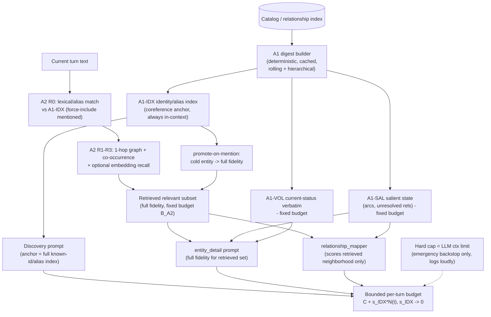

# Bounded Per-Turn Context Architecture (A1 + A2) — Design Report

**Status**: Design (pre-implementation). Architectural design-first artifact for the token-stabilization
epic (#477).
**Builds on**: `docs/design-token-stabilization.md` (PR #478) — the per-phase/per-lever token decomposition
of the same baseline run. This document assumes that decomposition and does not re-derive it; it cites the
measured numbers and extends them with an **architecture** that targets *bounded* per-turn growth, which the
PR #478 levers (L1/L2/L4) explicitly do **not** achieve on their own.
**Baseline run**: `eval-qwen36-344t-full` (344-turn full extraction, qwen3.6).
**Audience**: `@developer` (mechanism), `@quality-analyst` (coreference + fidelity review), `@model-optimizer`
(parameter interaction), `@extraction-specialist` (measurement / A/B).

> **Every projected token number in this document is an `[ESTIMATE]`** with its assumptions stated inline.
> Measured ground truth is drawn only from PR #478 / `eval-qwen36-344t-full` and is labelled MEASURED.
> The future *measured* A/B results should overwrite/compare against these estimates.

---

## Table of Contents

1. [Problem Restatement — why the levers halve but do not bound](#1-problem-restatement)
2. [Rejecting A3 (per-phase hard caps) as a stabilization strategy](#2-rejecting-a3)
3. [A1 — Bounded summary-based running state](#3-a1-bounded-summary-based-running-state)
4. [A2 — Retrieval-scoped high-fidelity injection](#4-a2-retrieval-scoped-injection)
5. [Complementarity — how A1 and A2 cover each other's blind spots](#5-complementarity)
6. [Coreference safety — the make-or-break property](#6-coreference-safety)
7. [Relationship to existing levers (L1/L4/L2)](#7-relationship-to-existing-levers)
8. [Quality risks and mitigations](#8-quality-risks-and-mitigations)
9. [Phasing, spike plan, and the long-run A/B requirement](#9-phasing-spike-and-ab)
10. [Open questions / decision points for the human](#10-open-questions)

---

## 1. Problem Restatement

### 1.1 The runaway (MEASURED, from PR #478)

Per-turn total input tokens across the four extraction phases fit a clean, **unbounded** straight line over
the 344-turn run:

$$\text{total\_input\_tokens}(t) = 15182 + 88.62 \cdot t \qquad (\text{MEASURED, linear fit, } n=374)$$

There is no plateau. A late turn costs ~2.5x an early turn (17,122 mean at t<=30 -> 43,084 mean at t>=300)
for the **same** per-turn narrative work. The driver is the `entity_detail` phase (**64.4%** of load at
scale) plus `relationship_mapper` (16.0%) plus the discovery known-entities block (12.7%). The sub-drivers,
each cited to the pipeline:

- **Detail-call count growth.** More entities get detailed as the catalog grows; capped at 6 by
  `_MAX_DETAIL_ENTITIES_PER_TURN = 6` ([tools/semantic_extraction.py](../tools/semantic_extraction.py#L1161)).
  The cap drops candidates (262 capped across the run) but does **not** flatten the curve up to the cap.
- **Uncapped PC relationship web.** `char-player` carries **109 active / 0 resolved** relationships at t344
  and re-serializes the entire web on every PC detail call, because `_format_prior_entity_context`
  ([tools/semantic_extraction.py](../tools/semantic_extraction.py#L1498-L1610)) applies arc-compaction to the
  PC but **not** the mention/recency filter nor the `_SCENE_MAX_RELATIONSHIPS = 8` cap
  ([tools/semantic_extraction.py](../tools/semantic_extraction.py#L1158)) that non-PC entities receive.
- **Per-call template repetition.** ~15K/turn is re-sent template+turn boilerplate across ~8.9 calls/turn
  (orthogonal slice; the L2 target).
- **Discovery known-entities block.** Grows with catalog size; built by `format_known_entities_bounded`
  ([tools/catalog_merger.py](../tools/catalog_merger.py#L676)) and injected at
  ([tools/semantic_extraction.py](../tools/semantic_extraction.py#L2818)). This block is the **coreference
  anchor** (Section 6).

### 1.2 Why L1/L4/L2 only halve the slope

PR #478 Section 4.3 is explicit and this design accepts its verdict: L1 (PC type-tiered cap), L4 (relmap
budget tiering), and L2 (batch entity_detail) attack **per-entity size**, **per-call repetition**, and **one
phase's budget** — they reduce the *coefficient* on each slice but every one of them still scales with the
**count of active entities/relationships** the turn must consider. The projected residual after L1+L4+L2 is
**~25-40 tok/turn** (down from 88.62), still **linear, still unbounded**, dominated by:

1. the discovery known-block growing with catalog size, and
2. irreducible per-entity content growth.

**The structural problem the levers cannot touch:** per-turn context size is *coupled to catalog size*. As
long as "what we inject this turn" is some function of "everything we know," the turn cost grows with the
session. **Bounding requires decoupling per-turn context size from catalog size** — injecting an amount of
context that is a function of *this turn's needs* plus a *fixed-size background*, not of the accumulated
total. That decoupling is the entire purpose of A1 + A2.

---

## 2. Rejecting A3

**A3 (per-phase hard token caps) is REJECTED as the stabilization strategy.**

PR #478 listed A3 as a candidate architectural lever ("clamp each phase to a fixed ceiling and let the budget
allocator drop lowest-priority content"). The human's steer rejects it, and this design adopts that
reasoning verbatim:

> A hard cap specifies only *that* you stay within a number, never *how*. "Just trim whatever is beyond the
> cap" makes the engine dumb: it pushes the hard decision (which information is worth keeping) onto a blind
> truncation step. The only legitimate hard cap is the **LLM's own token limit** — a physical constraint.
> Long before that limit, we must **intelligently reduce consumption**, choosing *what* to include by
> relevance and *what* to summarize by salience. A cap is an **emergency backstop at the context-window
> limit**, not a stabilization mechanism.

Concretely, A3-as-strategy fails on the property that matters most here: it has **no model of coreference
safety.** A blind per-phase cap that drops the lowest-priority entries from the discovery known-block removes
exactly the identity anchors whose loss causes duplicate re-extraction (Section 6) — this is the same failure
mode that got #468's catalog trimming rejected. A cap does not know that an identity line is cheap and must
never be dropped, while a verbose relationship history is expensive and *can* be summarized.

**Disposition of caps in this design:** retain a hard per-phase ceiling **only** as a safety backstop pinned
near the model context window (e.g. each phase prompt must not exceed `context_length - response_headroom`).
If a prompt would breach it, that is a *bug in the A1/A2 budgets* to be fixed, not a routine trimming event.
The backstop should **log loudly** when engaged, never silently. The intelligent reduction — A1 summarization
+ A2 retrieval — runs far below the backstop and is what actually keeps us bounded.

---

## 3. A1 — Bounded Summary-Based Running State

### 3.1 Definition

A1 replaces the **append-only full-catalog / full-relationship serialization** with a **bounded running state
digest** that is *maintained* (updated in place, rolled up) rather than *re-listed* in full. The digest has
three compartments, each with its own budget and refresh discipline:

| Compartment | Content | Budget `[ESTIMATE]` | Refresh cadence | Bounded by |
|---|---|---:|---|---|
| **A1-IDX** Identity index | One ultra-compact line per known entity: `id \| primary-name \| aliases \| type \| 1-line role`. The **coreference anchor**. | ~15-18 tok/entity; ~6K at N=344 | Append on new entity; edit on alias/identity change | Hierarchical rollup of cold entities (3.4) |
| **A1-SAL** Salient state | Permanent / high-salience facts: open arcs, **unresolved** relationships, durable stable_attributes, long-range callbacks. | fixed ~2,500 | Rolling: every N turns, or on arc/relationship status change | Salience ranking + fixed cap |
| **A1-VOL** Volatile current-status | The *current* status line for entities touched recently, kept **verbatim** (not summarized). | fixed ~1,500 | Every turn for touched entities | Recency window |

**Total A1 budget `[ESTIMATE]`:** `B_A1 = B_IDX + ~4,000`. Everything except `B_IDX` is a fixed budget
independent of session length. `B_IDX` is the single residual catalog-coupled term, and it is the
**cheapest possible** per-entity cost (an identity line, not a relationship web) — see Section 5.4 for why
this is the right place to concentrate the residual, and 3.4 for how to bound it too.

### 3.2 What is summarized vs kept verbatim

The cardinal rule (mirrors the L1 quality lesson and PR #478 Section 8): **summarize stable history; keep
volatile current-status verbatim.**

- **Kept verbatim (never summarized):** identity, aliases, current_status, status_updated_turn, open arcs,
  unresolved-relationship targets. These are the facts that, if blurred, produce *wrong current state* or
  *broken coreference*. They are also individually cheap.
- **Summarized (hierarchical / rolling):** relationship *history* lists, superseded volatile snapshots, and
  resolved relationships. The pipeline already has the primitives — `_build_volatile_digest`,
  `_compact_relationships_with_arcs`, and arc-aware compaction in
  [_format_prior_entity_context](../tools/semantic_extraction.py#L1498-L1610). A1 *promotes* these from
  per-call, per-entity local compaction into a **persisted, maintained** digest so the work is done once and
  carried, not recomputed and re-expanded every call.

### 3.3 Why "bounded" requires rolling/hierarchical summarization, not append-only

A naive "summary" that simply *appends* a one-line summary per entity per arc re-creates the runaway with a
smaller constant — it is still O(session). A1 is bounded only if summarization is **hierarchical and
rolling**:

- **Rolling within an entity:** when an entity accrues its (k+1)-th history entry, the oldest entries are
  folded into a single rolled summary line, so per-entity salient state is capped at a fixed size regardless
  of how many turns the entity has lived through. (Generalization of the existing
  `_ARC_AWARE_MAX_VOLATILE_SNAPSHOTS = 3` and PC volatile digest.)
- **Hierarchical across entities:** see 3.4.

### 3.4 Bounding the identity index (A1-IDX) too

`B_IDX` is O(N_entities). For practical sessions (N <= ~500) it is a few thousand tokens and is effectively
bounded. To bound it for arbitrarily long sessions, **tier the index by activity**:

- **Hot tier (verbatim):** entities mentioned/active within a recency window get the full `id | name |
  aliases | role` line.
- **Cold tier (compressed):** entities dormant for > M turns collapse to `id | primary-name | type` (aliases
  moved to a cold-storage lookup that A2's promote-on-mention path consults on a coreference near-miss).
  Cold lines are ~6-8 tokens.
- **Optional cluster rollup:** very large cold cohorts (e.g. all members of a defunct faction) can roll into
  a single cluster line plus a count, expanded on demand.

This concentrates the only remaining catalog-coupled growth into a tier whose per-entity cost can be driven
toward a small constant. **Coreference caveat (Section 6):** an entity's alias must remain *discoverable*
even when cold — the cold tier therefore keeps the primary name in-context and relies on A2's
promote-on-mention + an embedding fallback to recover dropped aliases. This is the single most quality-
sensitive knob in A1 and must be validated, not assumed.

### 3.5 Refresh cadence and determinism

- A1-VOL refreshes **every turn** for touched entities (cheap, correctness-critical).
- A1-SAL and the IDX hot/cold tiering refresh **on a fixed cadence** (every N turns) and **on status-change
  events** (arc opened/closed, relationship resolved, identity revealed). Event-driven refresh avoids staleness
  without per-turn recomputation cost.
- **Determinism:** the digest must be computed by a **deterministic** function of the catalog (sort keys,
  fixed rollup rules) so that temperature-0 runs remain byte-stable. If A1 uses an LLM-abstractive summary
  (Section 10, Q1), that summary must be cached and only recomputed on the cadence/event triggers — not every
  turn — or temp-0 byte-stability is lost.

---

## 4. A2 — Retrieval-Scoped Injection

### 4.1 Definition

A2 injects, per turn, only the **turn-relevant high-fidelity subset** of catalog state — at full detail —
under a **fixed budget** independent of catalog size. The relevant subset is:

1. **Mentioned-this-turn** entities (force-included — see 4.3),
2. their **1-hop relationship neighborhood**,
3. **active relationships** implicated by the turn,
4. a small **recency/co-occurrence backfill** to the budget.

This is *exactly* the selection problem `format_known_entities_bounded` already solves for the discovery
block ([tools/catalog_merger.py](../tools/catalog_merger.py#L676), #233: "mentioned entities first, then
co-located, then one-hop relationship targets, then recency backfill"). A2 **generalizes that proven
selection** from the discovery known-block to the `entity_detail` and `relationship_mapper` phases, which
today inject by recency/catalog order rather than turn relevance.

### 4.2 The retrieval signal

A layered signal, cheapest-first, each gated by budget:

| Layer | Signal | Cost | Role |
|---|---|---|---|
| R0 | Exact/alias **lexical match** of turn text against A1-IDX | trivial | Force-include set (4.3) |
| R1 | **Graph proximity** — 1-hop neighbors of R0 in the relationship index | cheap (index lookup) | Neighborhood |
| R2 | **Recent co-occurrence** — entities co-mentioned with R0 in the last K turns | cheap | Context |
| R3 | **Embedding similarity** (optional) — semantic recall for paraphrased/un-aliased mentions | moderate | Recall safety net |

R0-R2 are deterministic and lexical/graph-based (temp-0 safe, no model call). R3 is the optional recall
upgrade (Section 10, Q2) that catches the case A1's alias index misses — a re-mention by a *new* description
never seen before. Recommendation: **ship R0-R2 first** (they reuse #233 machinery and are deterministic),
add R3 only if A/B shows a coreference-recall gap.

### 4.3 Budget and plug-in points

**A2 budget `[ESTIMATE]`:** `B_A2 ~= 4,000-5,000 tokens` of full-fidelity entity detail, fixed regardless of
catalog size. Force-include guarantees: **every entity mentioned this turn is always in the high-fidelity set**
(never displaced by budget — if the mentioned set alone exceeds budget, that is a genuinely dense turn and the
backstop, not silent dropping, governs).

Plug-in points:
- **entity_detail:** the per-entity prior-state today comes from
  [_format_prior_entity_context](../tools/semantic_extraction.py#L1498-L1610). A2 supplies the *full-fidelity*
  prior state **only for the retrieved subset**; non-retrieved entities are represented solely by their
  A1 digest line. This replaces "detail the top-6 by confidence" with "detail the retrieved-relevant set,"
  and supplies the PC web at full fidelity **only when the PC is implicated** — subsuming L1 (Section 7).
- **relationship_mapper:** scores only the retrieved subset's 1-hop neighborhood instead of the full
  catalog pre-prune (which today can reach 40K+ before #385's budget compression). A2 moves the bound
  *upstream* of the scorer, so the expensive pre-prune disappears.

---

## 5. Complementarity

This is the core ask: A1 and A2 are **not** alternatives; each covers the other's failure mode.

### 5.1 A2's blind spot, covered by A1

A2's weakness is **long-range forgetfulness**: a long-dormant entity that suddenly recurs may not be
retrieved (no recent co-occurrence, weak graph proximity, lexical match only if the alias is known). Without
A1, that entity is **absent from context** -> the discovery phase sees no anchor -> it re-extracts a
**duplicate** (the exact `char-older-figure` vs `char-eldorman`, `*-hunter` splintering failure mode that got
#468 rejected).

**A1 covers it:** the compact A1-IDX identity/alias index is **always in context**. Even a 300-turn-dormant
entity still has its `id | name | aliases` line present, so discovery resolves the mention to the existing ID
(`is_new=false`) instead of minting a duplicate. A cheap **promote-on-mention** path then pulls that entity
from digest-only to A2 full-fidelity for the current turn.

### 5.2 A1's blind spot, covered by A2

A1's weakness is **fidelity loss**: the digest deliberately summarizes history and superseded state, so it
cannot answer fine-grained "what is the *current* detailed state of X and its relationships" for the entities
this turn actually operates on.

**A2 covers it:** for the small set the turn is *about*, A2 restores **full fidelity** — complete current
status, full active-relationship detail, full neighborhood — so the extraction quality for the turn's focus
entities is unchanged from today.

### 5.3 The combined per-turn budget (bounded)

Per-turn input decomposes into one catalog-coupled term and the rest fixed:

$$
\text{per\_turn}(t) \;\approx\; \underbrace{B_{\text{tmpl}} + B_{\text{turn}}}_{\text{fixed (L2 reduces)}}
\;+\; \underbrace{B_{\text{IDX}}(N)}_{\text{O(N), cheapest term}}
\;+\; \underbrace{B_{\text{SAL}} + B_{\text{VOL}}}_{\text{fixed (A1 caps)}}
\;+\; \underbrace{B_{\text{A2}}}_{\text{fixed (A2 caps)}}
$$

Only `B_IDX(N)` depends on the session; everything else is a fixed budget. And `B_IDX` is the **cheapest
possible** catalog term — identity lines, ~15-18 tok/entity hot, ~6-8 cold — and is hierarchically boundable
(3.4). So:

$$
\text{per\_turn}(t) \;\approx\; C + s_{\text{IDX}} \cdot N(t), \qquad
s_{\text{IDX}} \approx 15\text{-}18 \text{ tok/entity (hot) }\to 0 \text{ (cold rollup)} \quad [\text{ESTIMATE}]
$$

Since net new entities/turn `dN/dt` falls over a session (most entities appear early), and cold rollup drives
the cold-tier slope toward zero, the curve is **bounded in the limit** with a **small residual slope** during
the active-growth phase.

### 5.4 Projected curve vs the 88.62 baseline `[ESTIMATE]`

Assumptions: `B_tmpl+B_turn ~= 3,500` (with L2 batching to ~2 detail calls); `B_SAL ~= 2,500`;
`B_VOL ~= 1,500`; `B_A2 ~= 4,500`; `B_IDX` at ~16 tok/entity hot, with cold rollup beginning at the recency
window. Net entity counts taken to be ~N(t) growing sub-linearly (proxy: ~0.5-0.7 net entities/turn early,
tapering).

| Turn | Baseline MEASURED fit | A1+A2 projected `[ESTIMATE]` | reduction |
|---|---:|---:|---:|
| t100 | 24,044 | ~14,000-16,000 | ~33-42% |
| t200 | 32,906 | ~15,000-17,500 | ~47-54% |
| t344 | 45,667 | ~16,000-19,000 | ~58-65% |

The decisive difference vs PR #478's L1+L2+L4 projection (which lands at a *similar* t344 magnitude,
~22-28K, but with a residual slope of ~25-40 tok/turn spread across discovery-block growth **and**
irreducible per-entity content): A1+A2 **collapses the residual slope onto the single cheapest term**
(`B_IDX`, ~9-18 tok/turn during active growth `[ESTIMATE]`, -> ~0 with cold rollup), and removes the
per-entity-content slope entirely by replacing it with a fixed A2 budget. The curve **flattens** rather than
merely tilting.

```text
Per-turn total: baseline vs L1+L2+L4 vs A1+A2 (ESTIMATE)

46k |                                              B(baseline 88.62 slope) x
40k |                                       x
34k |                               x
28k |                 x
22k |          x                          L(L1+L2+L4: halved slope) o
18k |     x  B           o     o     o     o     o
16k |  A  A     A(A1+A2: flat after IDX warms) a  a  a  a  a  a  a
14k |  a  a
    +-----------------------------------------------------------
     0    50   100  150  200  250  300  344     (turn index)
```

### 5.5 Data flow



---

## 6. Coreference Safety — the Make-or-Break Property

This is the property that decides whether the design is shippable. The discovery phase sets `is_new=true`
**iff** an entity is **not** in the known list ([templates/extraction/entity-discovery.md](../templates/extraction/entity-discovery.md):
"is_new: true if NOT in known-entities list", plus the coreference rules "match mentions to known entities by
name, alias, role, or ID stem. Set is_new=false with existing_id"). Therefore:

> **An entity loses its coreference anchor the moment its identity/alias line leaves the in-context known
> list.** A dropped anchor -> the next mention is unrecognized -> a duplicate is minted. This is precisely
> why #468's catalog trimming was rejected (`char-older-figure` vs `char-eldorman`; `*-hunter` splintering).

A1 + A2 **must solve this, not inherit it.** The design guarantees:

1. **A1-IDX is always in context, for every known entity, every turn.** Identity lines are cheap (~15-18
   tokens), so even hundreds of entities cost only a few thousand tokens — affordable to keep verbatim. This
   is the categorical difference from #468: #468 dropped the entry *and its anchor*; A1 drops the expensive
   *history* while **keeping the anchor**.
2. **The cold tier never drops the primary name.** A dormant entity is compressed (aliases moved to cold
   lookup) but its `id | primary-name | type` line stays in-context, preserving the most common coreference
   path. Alias recovery on a near-miss is handled by A2 promote-on-mention + optional embedding recall (R3).
3. **Force-include of mentioned entities** (A2 4.3) guarantees that anything the lexical/embedding layer
   *does* match is pulled to full fidelity, so a recurring entity is both *anchored* (A1) and *re-detailed*
   (A2) in the same turn.

**Acceptance gate (non-negotiable):** the A/B (Section 9) must show **ZERO net new duplicate entities** vs
the baseline catalog over the full long run. Any duplicate regression fails the design, regardless of token
savings. `@quality-analyst` owns this gate.

---

## 7. Relationship to Existing Levers (L1/L4/L2)

| Lever (PR #478) | Status under A1+A2 | Reason |
|---|---|---|
| **L1** PC type-tiered relationship cap | **Subsumed by A2** (special case) | A2 injects the PC web at full fidelity *only when the PC is implicated this turn*, and even then bounds it by the A2 budget + relationship relevance. L1's "cap the PC web" becomes "the PC is one entity in the relevance budget." A1-SAL separately persists the PC's *unresolved* relationships so long-range callbacks survive without re-serializing all 109. |
| **L4** relmap budget tiering | **Subsumed / relocated by A2** | A2 bounds relmap's input *upstream* by scoring only the retrieved neighborhood, eliminating the 40K+ pre-prune. L4's budget-fraction tuning becomes the A2 retrieval budget for the relationship phase. |
| **L2** batch entity_detail | **Orthogonal — still complementary** | L2 attacks per-call *template+turn repetition*, which is independent of *which* entities are injected. A1/A2 reduce *content* per call; L2 reduces *call count*. They multiply. **Keep L2.** |
| **L3** detail selection-fix | **Partially subsumed; keep as guardrail** | A2's relevance/force-include selection is a principled replacement for "top-6 by confidence," and inherently includes state-change/mentioned entities. L3's "never drop a state-change entity" becomes an A2 force-include rule. Keep its *metric* (capped-entity state-change rate) as an A2 acceptance check. |

### 7.1 Recommendation: ship L1/L4/L2 first, then A1+A2

**Yes — ship the near-term levers first.** Rationale:

- **L2 is orthogonal and pure win** (helps from turn 1, ~10-16% of total, largest single lever) — it should
  land regardless of A1/A2 and *reduces the A1/A2 baseline* so the architectural delta is measured cleanly.
- **L1 and L4** deliver immediate latency relief (~9-16% combined) on a timeline far shorter than the A1/A2
  build, and they de-risk A1/A2 by proving the PC-web and relmap budgets can be tightened without quality
  loss — the same quality muscles A1/A2 need.
- A1/A2 is a **larger architectural build** (persisted digest, retrieval index, two-phase plumbing). Doing it
  *after* L1/L4/L2 means: (a) faster value delivery, (b) a tightened baseline that isolates A1/A2's true
  marginal contribution, and (c) the L1/L4 quality harnesses (callback retention, relationship recall) are
  reusable for A1/A2 validation.

Sequence: **L3 (guardrail) -> L1/L4 -> L2 -> A1 (anchor + digest) -> A2 (retrieval).**

---

## 8. Quality Risks and Mitigations

`@quality-analyst` reviews this section. Each risk pairs a failure mode with a concrete mitigation.

| # | Risk | Failure mode | Mitigation |
|---|---|---|---|
| Q-1 | **A2 retrieval MISS** | A turn-relevant entity is not retrieved -> long-range coreference/arc break, missing relationship update | A1-IDX anchor prevents the duplicate even on a retrieval miss; **force-include mentioned-this-turn**; tune R3 embedding recall; **promote-on-mention** restores fidelity. Measure retrieval recall against a labelled mentioned-set. |
| Q-2 | **A1 summary fidelity / staleness** | Digest reports a superseded current state -> wrong extraction | **Keep volatile current-status verbatim** (A1-VOL, never summarized); summarize only stable history (A1-SAL); event-driven refresh on status change; hierarchical rollup preserves a rolled summary line, never a silent drop. |
| Q-3 | **Cold-tier alias loss** (Section 3.4) | A dormant entity's alias drops from the hot index -> a paraphrased re-mention is unrecognized | Cold tier keeps the primary name in-context; A2 R3 embedding recall + promote-on-mention recover the alias; **gate cold-tiering behind the zero-duplicate A/B** — do not enable cold rollup until the hot-only digest is proven duplicate-safe. |
| Q-4 | **Attribute corruption from digest reuse** | A rolled summary mis-merges two entities' history | Deterministic per-entity rollup keyed on entity ID; per-entity ownership check on write; no cross-entity summarization in A1-SAL. |
| Q-5 | **Determinism loss** (if LLM-abstractive digest) | Temp-0 byte-stability breaks -> A/B determinism gate fails | Prefer deterministic extractive digest (Section 10 Q1); if abstractive, cache and recompute only on cadence/event, never per turn. |
| Q-6 | **Backstop masking a budget bug** | A1/A2 budget set too high, backstop silently truncates | Backstop logs loudly and is alarmed; treated as a bug, not routine trimming (Section 2). |

---

## 9. Phasing, Spike, and the Long-Run A/B Requirement

### 9.1 Phasing (safety floor first)

**Build A1 before A2.** A1's identity index is the **coreference safety floor**: it must be in place and
proven duplicate-safe before A2's relevance-selection narrows what gets full fidelity. Building A2 first would
risk the #468 failure mode during development.

1. **Phase A1a — Identity index + bounded digest (hot tier only).** Persist A1-IDX (all entities, verbatim
   aliases) + A1-SAL + A1-VOL. Wire the digest into discovery (replacing the recency-ordered known-block) and
   entity_detail prior-state. **No cold rollup yet.** Acceptance: zero new duplicates, equal extraction
   quality, measured token reduction.
2. **Phase A1b — Cold-tier rollup.** Enable activity-tiered IDX compression (3.4) behind a flag. Acceptance:
   still zero new duplicates (this is the risky step — Section 8 Q-3).
3. **Phase A2a — Deterministic retrieval (R0-R2).** Replace recency/confidence selection in entity_detail and
   relmap with #233-style relevance retrieval + force-include. Acceptance: relationship recall and state-change
   coverage hold; tokens bounded.
4. **Phase A2b — Embedding recall (R3), optional.** Add only if A/B shows a coreference-recall gap.

### 9.2 Minimal spike to validate the bounded-curve claim

Before the full build, a **read-only measurement spike**:
- Take the `eval-qwen36-344t-full` catalog snapshots at t50, t150, t250, t344.
- Compute, **offline (no extraction)**, the projected per-turn prompt size *as if* A1+A2 budgets were in
  effect: `B_IDX(N)` from the actual entity count, fixed A1/A2 budgets, and the measured template+turn cost.
- Plot the projected per-turn curve against the measured 88.62 line.
- **Success = the projected curve flattens** (slope dominated by `B_IDX`, ~9-18 tok/turn, vs 88.62) and
  `B_IDX` at t344 is within the ~6K `[ESTIMATE]`. This validates the *bound* claim cheaply, before any
  pipeline code, and refines every `[ESTIMATE]` in Section 5.4.

### 9.3 Long-run A/B requirement (critical)

**The A/B MUST use a long session (>=150 turns, ideally the full 344).** The runaway only manifests at scale:
a 30-turn run barely shows it (the catalog is still small, `B_IDX` and the PC web are tiny). This is the same
lesson as the dormant-compression test — short runs under-show the effect and can green-light a design that
fails at scale. Requirements:

- **Determinism:** same-GPU pin; temperature-0; if any non-determinism, run 2/3 and take the majority
  (per the project A/B standard for temp>0, applied here as a determinism guard).
- **Quality parity gates (all must pass):**
  1. **Entity-set retention** — A1+A2 catalog retains the baseline's entity set (no lost entities),
  2. **ZERO net new duplicates** (Section 6 gate — make-or-break),
  3. **No attribute corruption** (Section 8 Q-4),
  4. **Relationship recall** within tolerance of baseline,
  5. **State-change coverage** — no state-change entity dropped (the L3 metric).
- **Token gates:** measured per-turn slope reduced from 88.62 to the projected `B_IDX`-dominated residual;
  measured t344 per-turn within the Section 5.4 `[ESTIMATE]` band.

---

## 10. Open Questions / Decision Points for the Human

| # | Question | Options | Recommendation |
|---|---|---|---|
| **Q1** | **A1 summarization method** | (a) deterministic **extractive** (sort + truncate + rolled summary lines), (b) **LLM-abstractive** (a model condenses history) | **(a) extractive** for temp-0 byte-stability and zero extra model calls; revisit (b) only if extractive digests prove too lossy. Abstractive must be cached/event-triggered (Section 3.5). |
| **Q2** | **A2 retrieval signal** | (a) **lexical + graph** (R0-R2, deterministic), (b) add **embedding** (R3) | Ship **(a) first** (reuses #233, deterministic); add (b) only if A/B shows a coreference-recall gap (Q-1/Q-3). |
| **Q3** | **A1 refresh cadence** | every turn / every N turns / on-event | **Hybrid:** A1-VOL every turn; A1-SAL + IDX tiering every N turns **and** on status-change events. Tune N in the spike. |
| **Q4** | **Cold-tier aggressiveness (3.4)** | hot-only (no rollup) / recency-windowed cold tier / cluster rollup | Start **hot-only** (Phase A1a); enable cold rollup (A1b) only after the zero-duplicate gate passes; cluster rollup is a later optimization. |
| **Q5** | **Digest determinism vs richness** | strictly deterministic / allow cached-abstractive | **Strictly deterministic** unless the spike shows extractive digests measurably hurt quality. Determinism is required for the temp-0 A/B gate. |
| **Q6** | **A2 budget split across phases** | one shared retrieved set / per-phase budgets | Start with **one shared retrieved set** reused by entity_detail + relmap (simpler, cheaper); split only if a phase needs a different neighborhood depth. |

---

## Appendix A — Summary of Claims and Their Status

| Claim | Status |
|---|---|
| Per-turn baseline `15182 + 88.62*t`, no plateau | MEASURED (PR #478 / `eval-qwen36-344t-full`) |
| `entity_detail` 64.4% at scale; PC web 109/0 at t344 | MEASURED (PR #478) |
| L1+L4+L2 halve but do not bound the slope | MEASURED-derived projection (PR #478 Section 4.3) |
| A1+A2 per-turn `~= C + s_IDX*N(t)`, `s_IDX -> 0` with cold rollup | `[ESTIMATE]` (this doc, Section 5) |
| Projected t344 per-turn ~16-19K (~58-65% reduction) | `[ESTIMATE]` (Section 5.4) |
| Zero-duplicate coreference safety from always-in-context A1-IDX | DESIGN GUARANTEE, gated by long-run A/B (Section 6, 9.3) |
| Residual growth concentrated in cheapest term (identity index) | `[ESTIMATE]` (Section 5.4) |
