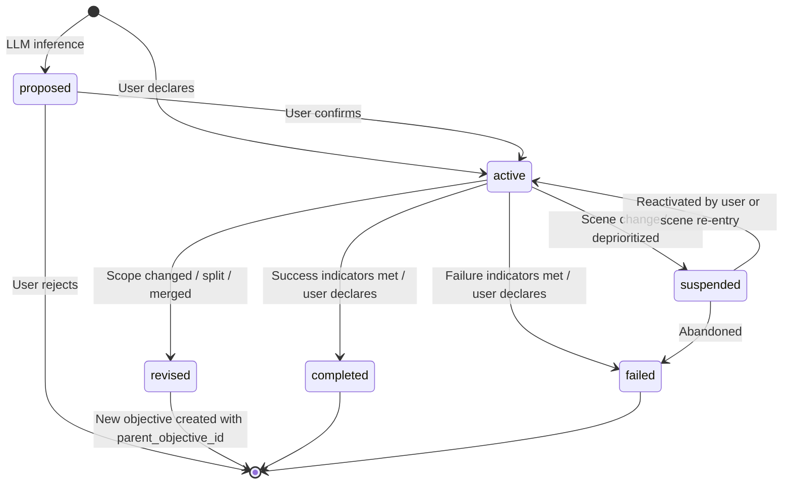
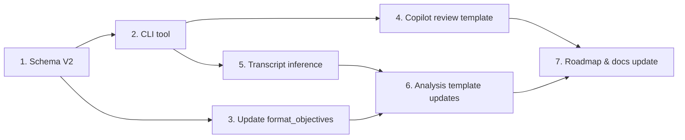

# Design: Player Objectives Framework

**Issue**: #261
**Status**: Proposal
**Date**: 2026-04-28

---

## 1. Problem Statement

The player objectives framework exists in schema only. `objectives.json` is always scaffolded as an empty array ([bootstrap_session.py](../tools/bootstrap_session.py) L306, [update_state.py](../tools/update_state.py) L157), and no tool, template, or workflow populates it.

This matters because objectives are already wired into the analysis pipeline. `analyze_next_move.py` [loads objectives](../tools/analyze_next_move.py#L194), [filters active ones](../tools/analyze_next_move.py#L96-L103), formats them into the analysis template (Section 7: "Objectives Affected"), and passes active objective IDs to [prompt candidate generation](../tools/analyze_next_move.py#L270-L273). The `prompt-candidates.json` schema already has an `objective_refs` field. All of this infrastructure produces empty output because there are no objectives.

### What's missing

| Gap | Impact |
|---|---|
| No mechanism to populate objectives | The entire objectives section of analysis is dead weight |
| Only two objective types (`strategic_long_term`, `tactical_short_term`) | No mid-term layer for active quests and sub-quests |
| No source provenance | Cannot distinguish user-declared goals from transcript-inferred ones (violates Rule 2 and Rule 3) |
| No entity/location linkage | Objectives exist in isolation; plot-threads have `related_entities` but objectives don't |
| No state transition model | No defined path for how objectives change status |
| No user input workflow | Player cannot tell the system what they want |
| No transcript inference | System cannot detect objectives from player actions |

The original design discussion in [idea-discussion.md](../docs/idea-discussion.md) L1143-1270 specified a `source_refs` field that never made it into the schema, and envisioned objectives as first-class entities with success/failure indicators — the indicators exist but nothing evaluates them.

---

## 2. Three-Layer Objective Model

### Taxonomy

The current two-layer model (`strategic_long_term`, `tactical_short_term`) lacks a middle tier. Issue #261 requests three layers:

| Layer | Horizon | Scope | Example |
|---|---|---|---|
| **Strategic** (`strategic`) | Campaign/arc | Character life goals, overarching ambitions | "Uncover my father's true identity" |
| **Operational** (`operational`) | Quest/chapter | Active quests, faction goals, multi-session arcs | "Complete the Trial of Mirrors for the Silver Order" |
| **Tactical** (`tactical`) | Scene/encounter | Immediate actions, dialog goals, combat objectives | "Convince the innkeeper to reveal the secret passage" |

**Terminology note**: The names `strategic`, `operational`, `tactical` follow standard planning hierarchy. The V1 values `strategic_long_term` and `tactical_short_term` are removed.

### Layer relationships

```
Strategic (1-3 per campaign)
  └─ Operational (3-8 active)
       └─ Tactical (1-5 per scene)
```

- **Strategic → Operational**: A strategic objective spawns or motivates operational objectives. Example: strategic "Uncover my father's true identity" drives operational "Investigate the sealed records in Thornhaven."
- **Operational → Tactical**: An operational objective decomposes into scene-level tactics. Example: operational "Investigate sealed records" drives tactical "Persuade the archivist to grant access."
- **Cross-layer independence**: Not every operational objective must have a strategic parent. A quest may stand alone. Not every tactical objective must trace to an operational parent — some are purely reactive ("Survive this ambush").

### Parent-child hierarchy

Objectives support an optional `parent_objective_id` field. This creates a tree, not a strict three-level chain:

```json
{
  "id": "obj-investigate-sealed-records",
  "type": "operational",
  "parent_objective_id": "obj-uncover-fathers-identity",
  "title": "Investigate the sealed records in Thornhaven"
}
```

Rules:
- `parent_objective_id` is optional. Omit it for root-level objectives.
- A `tactical` objective can be a child of either `operational` or `strategic`.
- An `operational` objective can be a child of `strategic`.
- A `strategic` objective cannot have a parent (it is always a root).
- Completing all children does not auto-complete a parent (the parent may have success criteria beyond its sub-objectives).
- Failing a child does not auto-fail a parent unless explicitly designed that way.

### Priority across layers

Priority (`priority` field, integer, 1 = highest) operates within and across layers:

- Tactical objectives generally have higher effective urgency because they're time-sensitive.
- Strategic objectives have higher importance but lower urgency.
- The analysis template should present objectives grouped by layer, with priority ordering within each group.
- When generating prompt candidates, tactical objectives take precedence for the immediate next action, but candidates should reference which strategic/operational objectives they also advance.

---

## 3. Schema V2 (Clean Break)

### Summary of changes from V1

| Change | Type |
|---|---|
| Replace `type` enum with three-layer values (`strategic`, `operational`, `tactical`) | Breaking |
| Remove `unknown` from `status` enum; add `revised`, `proposed` | Breaking |
| Add `source` field | New required field |
| Add `source_turns` field | New optional field |
| Add `related_entities` field | New optional field |
| Add `parent_objective_id` field | New optional field |
| Add `status_history` field | New optional field |
| Add `evidence_refs` field | New optional field |
| Add `scene_scope` field | New optional field |
| Add `created_turn` field | New required field |
| Add `confidence` field | New optional field |
| Add `id` pattern constraint | New constraint |

### Proposed schema (V2)

```json
{
  "$schema": "http://json-schema.org/draft-07/schema#",
  "$id": "objective.schema.json",
  "title": "Objective (V2)",
  "description": "A player objective across three layers: strategic (campaign), operational (quest), tactical (scene).",
  "type": "object",
  "required": ["id", "title", "type", "description", "priority", "status", "source", "created_turn", "last_updated_turn"],
  "additionalProperties": false,
  "properties": {
    "id": {
      "type": "string",
      "description": "Unique identifier, e.g. 'obj-find-missing-scholar'.",
      "pattern": "^obj-[a-z0-9]+(-[a-z0-9]+)*$"
    },
    "title": {
      "type": "string",
      "description": "Short human-readable title.",
      "minLength": 1
    },
    "type": {
      "type": "string",
      "description": "Objective layer: strategic (campaign arc), operational (quest/chapter), tactical (scene/encounter).",
      "enum": [
        "strategic",
        "operational",
        "tactical"
      ]
    },
    "description": {
      "type": "string",
      "description": "What achieving this objective requires."
    },
    "priority": {
      "type": "integer",
      "description": "Priority rank (1 = highest). Used to order prompt candidates.",
      "minimum": 1
    },
    "status": {
      "type": "string",
      "description": "Current status of this objective.",
      "enum": ["active", "completed", "failed", "suspended", "revised", "proposed"]
    },
    "source": {
      "type": "string",
      "description": "How this objective was identified.",
      "enum": ["user_declared", "transcript_inferred", "hybrid"],
      "default": "user_declared"
    },
    "source_turns": {
      "type": "array",
      "description": "Turn IDs that support or prompted this objective. Required for transcript_inferred and hybrid sources.",
      "items": {
        "type": "string",
        "pattern": "^turn-[0-9]{3,}$"
      }
    },
    "confidence": {
      "type": "number",
      "description": "Confidence in this objective's validity (0.0-1.0). Primarily for transcript_inferred objectives. Omit for user_declared.",
      "minimum": 0.0,
      "maximum": 1.0
    },
    "parent_objective_id": {
      "type": "string",
      "description": "ID of the parent objective in a quest hierarchy. Omit for root-level objectives.",
      "pattern": "^obj-[a-z0-9]+(-[a-z0-9]+)*$"
    },
    "success_indicators": {
      "type": "array",
      "description": "Observable signs that this objective has been or is being achieved.",
      "items": { "type": "string" }
    },
    "failure_indicators": {
      "type": "array",
      "description": "Observable signs that this objective has failed or is at risk.",
      "items": { "type": "string" }
    },
    "related_threads": {
      "type": "array",
      "description": "Plot thread IDs relevant to this objective.",
      "items": { "type": "string" }
    },
    "related_entities": {
      "type": "array",
      "description": "Entity IDs relevant to this objective.",
      "items": { "type": "string" }
    },
    "evidence_refs": {
      "type": "array",
      "description": "Evidence item IDs that support or contradict this objective.",
      "items": { "type": "string" }
    },
    "scene_scope": {
      "type": "string",
      "description": "For tactical objectives: the scene or turn range this objective is bound to. When the scene ends, the objective auto-transitions to completed/failed/suspended.",
      "pattern": "^turn-[0-9]{3,}$"
    },
    "created_turn": {
      "type": "string",
      "description": "Turn ID when this objective was created.",
      "pattern": "^turn-[0-9]{3,}$"
    },
    "last_updated_turn": {
      "type": "string",
      "description": "Most recent turn that affected this objective.",
      "pattern": "^turn-[0-9]{3,}$"
    },
    "status_history": {
      "type": "array",
      "description": "Append-only log of status transitions.",
      "items": {
        "type": "object",
        "required": ["status", "turn"],
        "additionalProperties": false,
        "properties": {
          "status": {
            "type": "string",
            "enum": ["active", "completed", "failed", "suspended", "revised", "proposed"]
          },
          "turn": {
            "type": "string",
            "pattern": "^turn-[0-9]{3,}$"
          },
          "reason": {
            "type": "string",
            "description": "Why this transition occurred."
          }
        }
      }
    }
  }
}
```

### Example: Strategic objective (user-declared)

```json
{
  "id": "obj-uncover-fathers-identity",
  "title": "Uncover my father's true identity",
  "type": "strategic",
  "description": "Discover who my character's father really was and what connection he had to the Crimson Court.",
  "priority": 1,
  "status": "active",
  "source": "user_declared",
  "success_indicators": [
    "Learn father's real name",
    "Discover his affiliation with the Crimson Court"
  ],
  "failure_indicators": [
    "All records of father are destroyed",
    "Key witness dies before being questioned"
  ],
  "related_threads": ["plot-crimson-court-conspiracy"],
  "related_entities": ["char-father", "faction-crimson-court"],
  "created_turn": "turn-001",
  "last_updated_turn": "turn-045",
  "status_history": [
    {"status": "active", "turn": "turn-001", "reason": "User declared at session start."}
  ]
}
```

### Example: Operational objective (hybrid source)

```json
{
  "id": "obj-investigate-sealed-records",
  "title": "Investigate the sealed records in Thornhaven",
  "type": "operational",
  "description": "Gain access to the sealed archives in the Thornhaven library to find records about the Crimson Court's founding members.",
  "priority": 2,
  "status": "active",
  "source": "hybrid",
  "source_turns": ["turn-032", "turn-038"],
  "confidence": 0.85,
  "parent_objective_id": "obj-uncover-fathers-identity",
  "success_indicators": [
    "Access granted to sealed archives",
    "Find document referencing father's name"
  ],
  "failure_indicators": [
    "Archives are destroyed",
    "Archivist refuses and alerts authorities"
  ],
  "related_threads": ["plot-sealed-tower"],
  "related_entities": ["loc-thornhaven", "char-archivist-maren"],
  "evidence_refs": ["ev-012", "ev-018"],
  "created_turn": "turn-032",
  "last_updated_turn": "turn-042",
  "status_history": [
    {"status": "proposed", "turn": "turn-032", "reason": "Inferred from player dialog about seeking records."},
    {"status": "active", "turn": "turn-033", "reason": "User confirmed inferred objective."}
  ]
}
```

### Example: Tactical objective (scene-scoped)

```json
{
  "id": "obj-persuade-archivist",
  "title": "Persuade the archivist to grant access",
  "type": "tactical",
  "description": "Convince Archivist Maren to open the sealed section without alerting the city guard.",
  "priority": 1,
  "status": "active",
  "source": "transcript_inferred",
  "source_turns": ["turn-042"],
  "confidence": 0.9,
  "parent_objective_id": "obj-investigate-sealed-records",
  "success_indicators": ["Archivist agrees to help", "Sealed section is accessible"],
  "failure_indicators": ["Archivist calls the guard", "Player is asked to leave"],
  "related_entities": ["char-archivist-maren", "loc-thornhaven"],
  "scene_scope": "turn-042",
  "created_turn": "turn-042",
  "last_updated_turn": "turn-042",
  "status_history": [
    {"status": "active", "turn": "turn-042", "reason": "Player entered archival scene; inferred from dialog intent."}
  ]
}
```

---

## 4. User Input Workflow

### Options evaluated

| Option | Approach | Pros | Cons |
|---|---|---|---|
| **A** Interview template | `.prompt.md` walks user through questions | Structured, thorough | Cold start only, no ongoing maintenance |
| **B** Inference + confirmation | LLM proposes, user confirms | Low friction | Misses goals not in transcript |
| **C** Interactive CLI | `manage_objectives.py` with subcommands | Scriptable, explicit | Higher friction, no inference |
| **D** Hybrid | LLM infers + user reviews/edits via template or CLI | Best of B and C | More complex to build |

### Recommendation: Option D (Hybrid) with phased delivery

**Phase 1 — CLI tool + Copilot template (immediate)**

A `tools/manage_objectives.py` CLI for explicit CRUD:

```
python tools/manage_objectives.py add --session sessions/session-001 \
  --type strategic --title "Uncover father's identity" \
  --description "..." --priority 1

python tools/manage_objectives.py list --session sessions/session-001 --status active

python tools/manage_objectives.py update --session sessions/session-001 \
  --id obj-uncover-fathers-identity --status completed --turn turn-088 \
  --reason "Father's identity revealed by DM."

python tools/manage_objectives.py infer --session sessions/session-001 \
  --turn turn-042
```

Plus a Copilot `.prompt.md` template (`templates/prompts/objectives-review.prompt.md`) that:
1. Reads the current `objectives.json`
2. Reads the last N turns of transcript
3. Asks the player structured questions:
   - "What is your character trying to accomplish long-term?"
   - "What quests or missions are you actively pursuing?"
   - "What do you want to achieve in the current scene?"
4. Produces updated `objectives.json` entries

**Phase 2 — Transcript inference (after extraction pipeline stabilizes)**

Add an `--infer` flag to `manage_objectives.py` that:
1. Sends recent transcript + existing objectives to the LLM
2. Receives proposed new/updated objectives with `source: transcript_inferred`
3. Writes them with `status: proposed` (not `active`)
4. The user reviews and promotes to `active` via the CLI or template

### Cold-start workflow

For a session with no objectives:

1. **Run the objectives review template** — Copilot asks the player about their goals at each layer. This captures objectives that are NOT in the transcript (pure player intent).
2. **Run inference** — `manage_objectives.py infer` scans the transcript for implied objectives. These arrive as `proposed`.
3. **User review** — Player confirms, modifies, or rejects proposed objectives.
4. **Ongoing maintenance** — After each turn, the analysis pipeline flags when objectives may have changed status, and the user can update via CLI or template.

### User-declared objectives not in transcript

This is a critical requirement. The player may have goals that:
- Were never stated in-character ("I want to eventually betray the faction")
- Are metagame ("I want to steer the story toward a redemption arc")
- Emerged from out-of-game discussion with the DM

These are captured via the CLI `add` command or the Copilot review template, and tagged with `source: user_declared`. They have no `source_turns` and no `confidence` — they are ground truth from the player.

---

## 5. Transcript Inference

### Pattern detection

The LLM should identify these signals in player dialog and actions:

| Signal | Example | Confidence |
|---|---|---|
| Explicit declaration | "I want to find the missing scholar" | 0.95 |
| Repeated attempts | Player has tried to enter the tower 3 times | 0.85 |
| Question patterns | "Where is the scholar?" asked multiple NPCs | 0.80 |
| Resource investment | Spent gold on equipment for a specific task | 0.70 |
| Dialog steering | Player keeps bringing conversation back to a topic | 0.75 |
| Quest acceptance | DM offers quest, player accepts | 0.95 |
| Declared intent to DM | "My character wouldn't do that, she's trying to..." | 0.90 |

### Integration point

Objective inference should be a **separate tool invocation**, not embedded in `ingest_turn.py` or `update_state.py`.

Rationale:
- Objective inference requires the full context of existing objectives (to avoid duplicates) and recent transcript (not just the current turn).
- It benefits from batching — inferring after every turn is noisy; inferring every 5-10 turns or at scene boundaries is more productive.
- Keeping it separate allows the user to control when inference runs.

The tool: `manage_objectives.py infer --session <path> [--turns <range>] [--threshold 0.7]`

### LLM prompt template

A template at `templates/extraction/objectives-inference.md` should:

1. Provide the last N turns of transcript (or a specified range)
2. Provide the current `objectives.json` (to avoid duplicates)
3. Provide the entity catalog (for `related_entities` population)
4. Ask the LLM to:
   - Identify new objectives implied by player behavior
   - Suggest status updates for existing objectives
   - Assign confidence scores
   - Cite specific turn IDs for each inference

Output format: JSON array of objective objects with `source: transcript_inferred` and `status: proposed`.

### Confidence thresholds

| Confidence | Action |
|---|---|
| >= 0.9 | Suggest with strong recommendation |
| 0.7 – 0.89 | Suggest with moderate confidence |
| 0.5 – 0.69 | Suggest as speculative |
| < 0.5 | Do not suggest |

All inferred objectives arrive as `status: proposed` regardless of confidence. The user must explicitly promote them to `active`.

---

## 6. Objective Lifecycle

### State machine



### Transition rules

| From | To | Trigger | Who decides? |
|---|---|---|---|
| — | `proposed` | LLM inference detects pattern | System |
| — | `active` | User declares via CLI/template | User |
| `proposed` | `active` | User confirms inference | User |
| `proposed` | (deleted) | User rejects inference | User |
| `active` | `completed` | Success indicator matched in transcript, or user declares | User (with system suggestion) |
| `active` | `failed` | Failure indicator matched in transcript, or user declares | User (with system suggestion) |
| `active` | `suspended` | User pauses; scene changes for tactical objectives | User or system (tactical auto-suspend) |
| `active` | `revised` | Objective scope changes significantly | User |
| `suspended` | `active` | User reactivates; relevant scene resumes | User or system |
| `suspended` | `failed` | User explicitly abandons | User |

### Tactical objective auto-resolution

Tactical objectives with a `scene_scope` field auto-transition when the scene ends:

- If success indicators were met during the scene → suggest `completed`
- If failure indicators were met → suggest `failed`
- If neither → suggest `suspended`

"Scene end" detection is a heuristic: significant location change, time skip, or new chapter marker in the transcript. The system suggests the transition; the user confirms.

### The `revised` status

`revised` means the objective's scope changed enough that it should be considered a new objective. When an objective is revised:

1. The old objective gets `status: revised` with a `status_history` entry explaining the change.
2. A new objective is created with `parent_objective_id` pointing to the old one.
3. The new objective inherits `related_threads`, `related_entities`, and `evidence_refs` from the old one (user can modify).

This preserves the provenance chain. Example: "Find the missing scholar" gets revised to "Find the missing scholar's journal" after learning the scholar is dead.

---

## 7. Analysis Integration

### Current state

`analyze_next_move.py` already:
- Loads `objectives.json` and filters active objectives ([L192-195](../tools/analyze_next_move.py#L192))
- Formats them as `- **[type]** title` bullets via `format_objectives()` ([L96-103](../tools/analyze_next_move.py#L96))
- Passes active objective IDs to prompt candidate generation ([L270-273](../tools/analyze_next_move.py#L270))

### Proposed improvements

#### 1. Layer-grouped objective display

Replace the flat bullet list with a grouped format:

```markdown
## 7. Objectives Affected

### Strategic
- **[P1]** Uncover my father's true identity

### Operational
- **[P2]** Investigate the sealed records in Thornhaven _(parent: Uncover my father's true identity)_

### Tactical
- **[P1]** Persuade the archivist to grant access _(scene: turn-042)_
```

Updated `format_objectives()`:

```python
def format_objectives(objectives: list) -> str:
    active = [o for o in objectives if o.get("status") == "active"]
    if not active:
        return "_No active objectives established yet._"

    sections = []
    for layer in ["strategic", "operational", "tactical"]:
        layer_objs = sorted(
            [o for o in active if o.get("type") == layer],
            key=lambda x: x.get("priority", 99),
        )
        if layer_objs:
            sections.append(f"### {layer.capitalize()}")
            for o in layer_objs:
                priority = o.get("priority", "?")
                title = o.get("title", "Untitled")
                parent = o.get("parent_objective_id", "")
                suffix = f" _(parent: {parent})_" if parent else ""
                sections.append(f"- **[P{priority}]** {title}{suffix}")

    return "\n".join(sections) if sections else "_No active objectives established yet._"
```

#### 2. Prompt candidate objective metadata

Expand `objective_refs` in prompt candidates to include layer context. Two options:

**Option A**: Keep `objective_refs` as string array (current), add display-only layer info to the analysis markdown. Simpler, no schema change to prompt-candidates.

**Option B**: Change `objective_refs` to an array of objects:
```json
"objective_refs": [
  {"id": "obj-persuade-archivist", "layer": "tactical"},
  {"id": "obj-investigate-sealed-records", "layer": "operational"}
]
```

**Recommendation**: Option A for now. The prompt candidate schema doesn't need to duplicate objective metadata; it can be resolved at render time by joining against `objectives.json`.

#### 3. Objective progress in analysis

Add a progress section to the analysis template:

```markdown
## 7. Objectives Affected

### Progress Since Last Turn
- **obj-investigate-sealed-records**: New evidence — archivist mentioned a "restricted key" (turn-043)
- **obj-persuade-archivist**: Archivist is receptive but cautious; success indicator partially met

### Active Objectives
...
```

This requires the LLM analysis to compare the current turn against success/failure indicators and report matches. The analysis template should include the `success_indicators` and `failure_indicators` in its context so the LLM can evaluate them.

#### 4. Conflict resolution

When objectives conflict (e.g., tactical "avoid attention" vs. operational "confront the guard captain"), the analysis should:

1. Flag the conflict explicitly in the analysis.
2. Generate at least one prompt candidate for each conflicting objective.
3. Generate at least one prompt candidate that attempts to satisfy both.
4. Let the user choose — the system does not resolve conflicts.

---

## 8. Edge Cases and Open Questions

### Edge case: No declared objectives

**Current state and the common case for new sessions.**

The system should remain fully functional with an empty `objectives.json`:
- `format_objectives()` already returns "_No active objectives established yet._"
- Prompt candidates should still be generated based on plot threads, evidence, and DM profile alone.
- The analysis template should include a nudge: "Consider declaring your objectives to improve prompt recommendations."

### Edge case: Inferred objectives conflict with user-declared

If the LLM infers an objective that contradicts what the user declared:
- Present both with rationale.
- Do not auto-modify user-declared objectives.
- Flag the discrepancy: "Inferred objective X appears to conflict with your declared objective Y. Is your strategy changing?"

### Edge case: Impossible objectives

If an objective becomes impossible (e.g., quest giver died, location destroyed):
- The analysis pipeline should flag objectives whose failure indicators were met.
- Suggest status transition to `failed` with a reason.
- Do not auto-fail — the user may know something the system doesn't (e.g., resurrection is possible).

### Edge case: Multiple tactical objectives in one scene

This is normal and expected. A scene with combat might have:
- "Protect the prisoner"
- "Disable the enemy mage first"
- "Avoid using fire magic (the room is full of oil)"

These should all be `tactical` with `scene_scope` pointing to the same turn. They can have different priorities. The analysis should present all of them and generate candidates that address multiple tactical objectives simultaneously where possible.

### Edge case: Quest chains

Completing an objective may reveal a new one. Example: completing "Find the key" reveals "Open the vault."

This is handled by:
1. Mark the completed objective as `completed`.
2. Create a new objective (possibly as a child of the same parent, or a new root).
3. The system does NOT auto-create chain objectives — the user or the LLM inference (as `proposed`) handles this.

### Open questions

1. **Should the Objectives agent be a new entry in the Phase 2 roadmap table?** Currently, [roadmap.md](../docs/roadmap.md) L16-28 lists agents with no Objectives agent. It could be a standalone agent or a responsibility shared between the Catalog agent and Strategy agent.

2. **How detailed should tactical objectives be?** If every scene generates 3-5 tactical objectives, `objectives.json` could grow large. Consider an archival mechanism (move completed/failed tactical objectives to a separate file after N turns).

3. **Should `scene_scope` reference a single turn or a turn range?** A scene may span multiple turns. A range (`turn-042:turn-047`) would be more accurate but adds complexity.

4. **Should objectives appear in wiki pages?** The wiki generation system could render an "Active Objectives" page with progress tracking.

5. **How should the objectives review template interact with Copilot Chat?** The `.prompt.md` template needs to read files and produce JSON output — this matches the agent mode pattern but needs testing with the current Copilot capabilities.

---

## 9. Implementation Sequencing



### Recommended order

| Step | Deliverable | Depends on | Effort |
|---|---|---|---|
| **1** | Update `objective.schema.json` to V2 | — | Small |
| **2** | Create `tools/manage_objectives.py` with `add`, `list`, `update`, `complete` subcommands | Step 1 | Medium |
| **3** | Update `format_objectives()` in `analyze_next_move.py` for three-layer display | Step 1 | Small |
| **4** | Create `templates/prompts/objectives-review.prompt.md` Copilot template | Step 2 | Small |
| **5** | Add `infer` subcommand to `manage_objectives.py` with LLM template | Step 2 | Medium |
| **6** | Update analysis template to include objective progress and indicator matching | Steps 3, 5 | Medium |
| **7** | Update `docs/architecture.md`, `docs/roadmap.md`, `docs/usage.md` | Steps 1–6 | Small |

Steps 2 and 3 can proceed in parallel after Step 1.
Steps 4 and 5 can proceed in parallel after Step 2.

### Schema migration

Since `objectives.json` is always `[]` in all existing sessions, no data migration is needed. The V1 schema is fully replaced — there are no existing objectives to convert.

The V1 `type` values (`strategic_long_term`, `tactical_short_term`) and status value `unknown` are removed. Any code referencing those values must be updated.

### Validation

Existing `tools/validate.py` should handle the updated schema automatically since it validates against `schemas/objective.schema.json`. A new test should verify:
- Three-layer objectives validate
- V1-style objectives (with `strategic_long_term` type) are **rejected**
- `parent_objective_id` references are checked (referential integrity)
- `status_history` entries are monotonically ordered by turn
