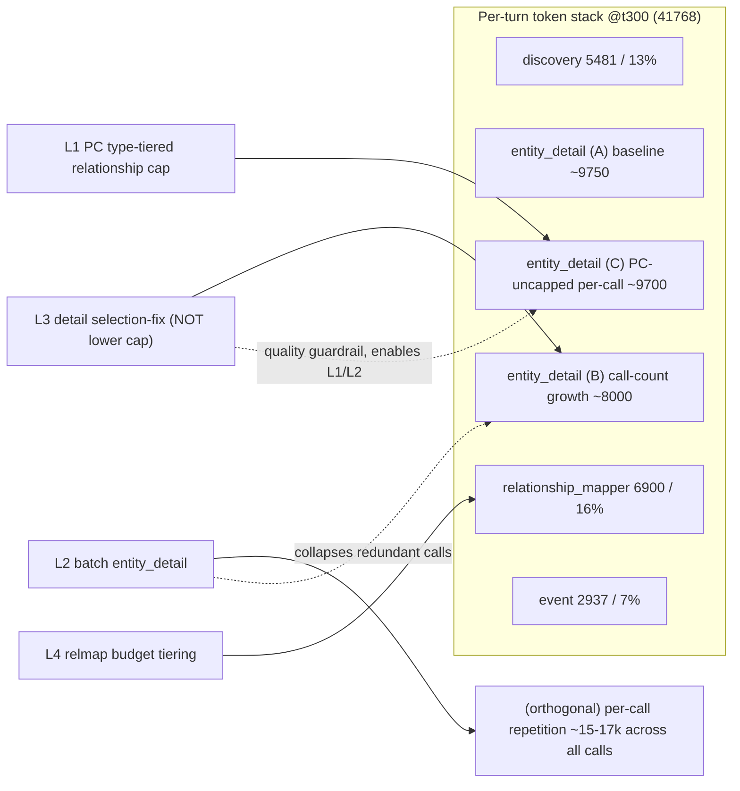

# Per-Turn Extraction Token Stabilization — Design Report

**Status**: Design (pre-implementation). Deep-design-first artifact for the token-stabilization epic.
**Baseline run**: `eval-qwen36-344t-full` (344-turn full extraction, qwen3.6; 374 logged extraction records across the 344 distinct turns -- turns 1-30 were re-extracted and so are each logged twice).
**Audience**: pipeline engineers (`@developer`), quality (`@quality-analyst`), model (`@model-optimizer`), and the dashboard developer.

> **Every projected token number in Sections 3 and 4 is an ESTIMATE.** Estimates are labelled `[ESTIMATE]`
> with their assumptions stated inline, so the future *measured* impact (from A/B runs) can be compared
> against the prediction fairly. Section 2 contains *measured* ground truth from the baseline run only.

---

## Table of Contents

1. [Goal and the Runaway](#1-goal-and-the-runaway)
2. [Per-Phase Decomposition](#2-per-phase-decomposition)
3. [Per-Lever Target Mapping](#3-per-lever-target-mapping)
4. [Combined Projection](#4-combined-projection)
5. [What Each Lever Does *Not* Fix](#5-what-each-lever-does-not-fix)
6. [Dashboard Data Spec](#6-dashboard-data-spec)
7. [Baseline Note](#7-baseline-note)

---

## 1. Goal and the Runaway

### 1.1 Goal

Make per-turn extraction input-token consumption **bounded** (asymptotic / sub-linear) as a session grows,
instead of growing **linearly without limit** with the turn index. Concretely: keep a 344-turn session's
late-turn per-turn load close to its early-turn load, so latency and context-window pressure do not
escalate as the catalog accumulates. A late turn must not cost 2.5x an early turn for the same narrative
work.

### 1.2 The runaway (MEASURED)

Per-turn **total input tokens** across the four extraction phases fit a clean straight line over the
full 344-turn run:

$$\text{total\_input\_tokens}(t) = 15182 + 88.62 \cdot t \qquad (n = 374,\ \text{linear fit})$$

Here `n = 374` is the number of per-turn **extraction-log records** the fit is computed over, *not* a turn count: the run covers **344 distinct turns**, but turns 1-30 were re-extracted, so the first 30 turns contribute 60 records (314 single-record turns + 30 double-logged turns = 374 records). Every band mean in Section 2 is likewise a **per-record** mean.

There is **no plateau** — the trend is linear and unbounded across the entire run. The slope of
**~88.6 tokens per turn** is the runaway.

| Turn index | Per-turn total (tokens) | Source |
|---|---|---|
| t0 (intercept) | 15,182 | fit |
| t30 | 17,841 | fit |
| t100 | 24,044 | fit (extrapolated) |
| t150 | 28,475 | fit |
| t200 | 32,906 | fit (extrapolated) |
| t300 | 41,768 | fit |
| t344 | 45,667 | fit |

Measured band means corroborate the fit: actual mean total was **17,122** for t<=30 and **43,084** for
t>=300 — a **2.5x growth** in per-turn cost across the session for the same per-turn narrative input.

```text
Per-turn total input tokens vs turn index (MEASURED, linear, no plateau)

46k |                                                              x  t344
    |                                                       x
40k |                                              x   t300
    |                                       x
34k |                               x  t200
    |                        x
28k |                 x  t150
    |          x
22k |     x  t100
    | x  t30
16k |x  t0
    +----------------------------------------------------------------
     0    50   100   150   200   250   300   344   (turn index)
```

The slope is the problem. Sections 2–3 localize **where** the slope lives and **which lever attacks which
slice**.

---

## 2. Per-Phase Decomposition

### 2.1 Tokens by phase, by turn band (MEASURED)

All numbers below are **measured band means** from `eval-qwen36-344t-full`. `% share` is computed within
the band's total.

| Phase | t1–30 | t150–180 | t300–344 | share @t300–344 |
|---|---:|---:|---:|---:|
| discovery | 2,991 | 4,627 | 5,481 | 12.7% |
| **entity_detail** | **9,831** | **18,521** | **27,767** | **64.4%** |
| relationship_mapper | 2,546 | 5,492 | 6,900 | 16.0% |
| event_extractor | 1,754 | 1,894 | 2,937 | 6.8% |
| **TOTAL** | **17,122** | **30,536** | **43,084** | 100% |
| LLM calls / turn | 6.12 | 7.84 | 8.93 | — |

**`entity_detail` is the dominant phase and the dominant *growth* vector**: it is 57% of total at t1–30
and rises to **64.4%** at scale, while absorbing most of the slope (it grows +17,936 tokens/turn from the
early band to the late band; the whole-turn total grows +25,962, so entity_detail is ~69% of the *growth*).

```text
Stacked composition of per-turn tokens (MEASURED band means)
(dashboard renders this as a STACKED AREA: x = turn, y = tokens, 4 bands)

 t1-30   [#### discovery 2991 ][########## entity_detail 9831 ][### relmap 2546][## evt 1754]  = 17122
 t150-180[##### disc 4627     ][################## entity_detail 18521 ][##### relmap 5492][## 1894] = 30536
 t300-344[###### disc 5481    ][########################## entity_detail 27767 ][###### relmap 6900][### 2937] = 43084
                 12.7%                       64.4%                          16.0%          6.8%
```

### 2.2 Per-phase slope contribution (MEASURED, derived)

Dividing each phase's early->late growth by the **~306 turns** separating the two band midpoints
(t1-30 midpoint t15.5, t300-344 midpoint t322):

| Phase | early->late growth | approx slope (tok/turn) | share of 88.6 slope |
|---|---:|---:|---:|
| entity_detail | 9,831 -> 27,767 | ~59 | ~66% |
| relationship_mapper | 2,546 -> 6,900 | ~14 | ~16% |
| discovery | 2,991 -> 5,481 | ~8 | ~9% |
| event_extractor | 1,754 -> 2,937 | ~4 | ~5% |

> **Note — two-band approximation, not an exact decomposition.** These per-phase slopes are a two-point
> estimate between the early and late band means, not a per-phase OLS fit. They sum to **~85 tok/turn**
> (the two-band total slope `(43,084 - 17,122) / 306`), which **approximates but does not equal** the global
> OLS slope of **88.62** computed over all 374 records (the mid-session band and per-record dispersion pull
> the OLS slope slightly higher). The `share of 88.6 slope` column therefore sums to **~96%**, not 100%;
> treat it as indicative attribution, not an exact split.

The phase **shares** and the **slope shares** line up: entity_detail dominates both the level and the
growth. Stabilization therefore has to win inside entity_detail first.

### 2.3 The three sub-drivers inside `entity_detail` (MEASURED + derived)

`entity_detail` total = (number of detail calls) x (tokens per detail call). Both factors grow:

| Sub-driver | t1–30 | t300–344 | what it is |
|---|---:|---:|---|
| detail calls / turn | 3.25 | 5.93 | more entities detailed as catalog grows (cap = 6) |
| tokens / detail call | 3,000 | 4,631 | per-call prompt grows (PC prior-state web) |
| detail total | 9,831 | 27,767 | product of the two |

Attributing the late-band detail total (27,767) to the three sub-drivers using a level/growth split
(baseline = early `3.25 x 3000 = 9,750`):

| Sub-driver | est. tokens @t300–344 | mechanism |
|---|---:|---|
| **(A) irreducible baseline** | ~9,750 | 3.25 calls x 3,000 baseline/call — the early floor |
| **(B) call-count growth** | ~8,000 | the +2.68 marginal calls valued at the baseline per-call rate |
| **(C) PC-uncapped per-call growth** | ~9,700 | per-call size growth (incl. interaction), dominated by the PC detail call carrying an **uncapped relationship web** |

> Attribution method `[derived]`: (A) = `3.25 x 3000`; (B) = `(5.93-3.25) x 3000`; (C) = `3.25 x (4631-3000)`
> + interaction `(5.93-3.25) x (4631-3000)` (= `5.93 x 1631`). A+B+C = `5.93 x 4631` ~= 27,460, and B+C ~=
> the measured +17,936 detail growth (within band-mean noise; the small gap is the calls-vs-per-call
> covariance, since mean(calls) x mean(per-call) != mean(calls x per-call)). These are a
> *decomposition of measured aggregates*, not independent measurements of each sub-driver.

**The PC-uncapped web, in detail (MEASURED at t344):** `char-player`'s catalog entry carries **109
relationships**, of which **109 are active and 0 resolved**, with **near-uniform recency**
(`<=t100: 23`, `t101–200: 30`, `t201–300: 27`, `>t300: 29`). The PC detail prompt re-serializes this entire
web on every PC detail call because `_format_prior_entity_context` (`tools/semantic_extraction.py` ~L1498)
applies arc-compaction to the PC but **does NOT apply the mention/recency filter or the
`_SCENE_MAX_RELATIONSHIPS = 8` cap** that non-PC entities get (see docstring ~L1640–1650 — "Mention/recency
filtering is *not* applied" for the PC). Non-PC detail calls are capped at 8 relationships; the PC call
carries all 109. This is sub-driver (C) and it is the **single largest remaining controllable slice**.

### 2.4 The orthogonal lens: per-call repetition (MEASURED, derived)

The phase view double-counts a cross-cutting cost: **every** LLM call (~8.93/turn at t300) re-sends the
phase **template instructions plus the full current-turn text**. With template+turn boilerplate estimated
at ~1,700–1,900 tokens/call, that is **~15,000–17,000 tokens/turn of pure repetition** at t300 — re-sent
content carrying zero incremental information. Within `entity_detail` alone (5.93 calls) the repetition is
~10,000–11,000 tokens. There is **no rolling-history window**: each phase sees only the current turn text,
so this repetition is the *only* turn-text cost — but it is paid once per call, not once per turn.

This is an orthogonal slice (it overlaps the per-phase numbers, it is not additive to them); it is the
target of lever **L2**.

---

## 3. Per-Lever Target Mapping

Four levers. For each: **(a)** the slice it attacks, **(b)** honest expected return `[ESTIMATE]` with
assumptions, **(c)** confidence + failure modes, **(d)** quality risk, **(e)** prerequisite.

> All per-turn savings are quoted **at t300** (where the runaway is worst) and as **% of the t300 total of
> 41,768**. Cumulative figures integrate the savings over a full 344-turn session. The PC web and catalog
> grow roughly linearly, so most levers' savings **ramp from ~0 early to their t300 value** — early-turn
> savings are small by construction.

### Lever -> stack-slice map



---

### L1 — PC type-tiered relationship cap

**(a) Slice attacked.** `entity_detail` sub-driver **(C)** — the PC-uncapped per-call growth. The PC
detail call serializes all 109 relationships; L1 caps the PC web with a **type-tiered** policy (keep recent
+ arc-flagged + at least one per relationship-type and per target entity-type, so long-range callbacks
survive) targeting ~20–30 retained relationships instead of 109.

**(b) Expected return `[ESTIMATE]`.** Assume each compacted PC relationship serializes to ~35–50 tokens
(id, type, status, short history) -> full 109-rel web ~3,800–5,500 tokens; type-tiered to ~25 -> ~900–1,300
tokens. **Per-turn savings at t300: ~2,000–4,000 tokens (~5–9% of the 41,768 total).** Savings ramp from
~0 (early, small PC web) to the t300 value. **Cumulative over 344 turns: ~0.35–0.65M tokens**
(triangular integral of a linearly-growing saving).
*Assumptions:* per-rel token cost 35–50; arc-compaction already applied; PC volatile-state untouched by L1.

**(c) Confidence: MEDIUM.** Wrong if arc-compaction already shrinks the web more than assumed (savings
lower) or if PC volatile-state, not relationships, is the bigger share of the PC prompt (then L1 under-
delivers and the real fix is volatile-state digesting). Needs the measured PC-prompt token breakdown to
firm up.

**(d) Quality risk: HIGH if naive (`@quality-analyst`).** The 23 relationships at `<=t100` are exactly the
**long-arc callback anchors**; a recency-only cut would silently kill long-range callbacks and re-introduce
duplicate re-extraction. L1 **must tier by type** (retain per-type/per-target representatives + arc-flagged
+ recent), never a flat recency truncation.

**(e) Prerequisite.** A/B (>=3 runs, equal-or-better extraction quality with callback-retention check).
Ships **after** L3 (selection guardrail). **Highest-priority** remaining driver.

---

### L4 — Relationship-mapper budget tiering

**(a) Slice attacked.** `relationship_mapper` phase (16% / 6,900 tokens at t300). #385 already gave relmap
a 20%-of-context budget with 3-tier relevance scoring, but the pre-pruning scoring block can reach 40K+
before compression and the post-budget cost still grew 2,546 -> 5,492 -> 6,900. L4 tightens the tier
thresholds / lowers the budget fraction so relmap flattens.

**(b) Expected return `[ESTIMATE]`.** Tightening the budget from ~16% toward ~10–11% of total -> cap relmap
near ~4,000–4,500. **Per-turn savings at t300: ~1,500–2,900 tokens (~4–7% of total).** **Cumulative:
~0.25–0.50M tokens.**
*Assumptions:* relmap scoring already instrumented (#385); pruning quality holds at the tighter budget.

**(c) Confidence: MEDIUM-HIGH.** relmap is already budgeted and instrumented, so it is the easiest to tune
predictably. Wrong if the 3-tier scoring is already near-optimal (little slack to recover) or if a lower
budget forces dropping genuinely co-occurring pairs.

**(d) Quality risk: MEDIUM.** Over-tight tiers drop real relationships -> relationship-recall regression.
Bounded by keeping the highest-priority tier intact and only trimming tier-2/3.

**(e) Prerequisite.** A/B with a relationship-recall metric. Independent of L1/L2/L3 (different phase),
**parallel-safe**.

---

### L2 — Batch `entity_detail`

**(a) Slice attacked.** The **per-call repetition** orthogonal slice (~15–17K/turn), and secondarily
sub-driver **(B)**. Batching several entities into **one** detail call removes redundant template+turn
re-sends. 5.93 detail calls -> ~2 batched calls eliminates ~4 redundant re-sends of ~1,700-token boilerplate.

**(b) Expected return `[ESTIMATE]`.** `(5.93 - 2) x ~1,700 ~= 6,700` gross; net of a larger single-call
prompt and per-entity structure, **per-turn savings at t300: ~4,000–7,000 tokens (~10–16% of total)** —
the **largest single lever**. Unlike L1/L4 this also helps **early** turns (repetition is paid from turn 1),
so **cumulative: ~1.2–2.4M tokens** over 344 turns.
*Assumptions:* template+turn boilerplate ~1,700/call; batching 5.93 -> ~2 calls; multi-entity extraction
quality holds.

**(c) Confidence: MEDIUM.** Wrong if the model degrades on multi-entity prompts (forcing smaller batches ->
less saving) or if structured multi-entity output needs so much scaffolding it eats the repetition saving.

**(d) Quality risk: HIGH — attribute bleed (`@quality-analyst`).** A batched call can cross-assign
attributes between co-listed entities. Mitigate with hard per-entity delimiters, per-entity output slots,
and a post-parse ownership check; validate with a bleed-rate metric in A/B.

**(e) Prerequisite.** Non-trivial template + parser rework; A/B with attribute-bleed metric. **Highest
risk/reward**; sequence after L1/L4 land so its delta is measured against a tightened baseline.

---

### L3 — Detail selection-fix (NOT a lower cap)

**(a) Slice attacked.** sub-driver **(B)** call-count growth — but **not** by lowering the cap. The cap=6
already drops entities (across the run **262 non-PC entity-detail candidates were skipped** — the run total of
the `entity_detail_capped_count` log field, summed over the 78 turns that hit the per-turn detail cap of 6;
each skipped candidate is an entity that was *not* re-detailed that turn, i.e. a dropped detail call, **not**
a confirmed lost state update). L3 fixes *which* 6 are kept so the cap never
drops a **state-change** entity (an entity whose status/volatile-state changed this turn), replacing the
current "PC + new + existing-by-confidence" ordering with change-aware selection.

**(b) Expected return `[ESTIMATE]`.** **~0 token savings — possibly slightly negative.** L3 is a
**quality guardrail**, not a token lever; it may *add* a few hundred tokens/turn by ensuring a state-change
entity is detailed instead of being skipped. Its value is that it **unlocks L1 and L2 safely** (you can
compress the PC web and batch calls only once you trust that important entities are never dropped).

**(c) Confidence: HIGH that token impact is ~neutral.** Low uncertainty because it reorders rather than
resizes.

**(d) Quality risk: the selection must NOT drop state-change entities (`@quality-analyst`).** That is the
whole point of L3; the risk is in *not* doing it (the **262 skipped entity-detail candidates** may have silently dropped real
state changes — quality impact currently unknown).

**(e) Prerequisite.** **Ships first** as the guardrail that makes L1's PC cap and L2's batching safe to
A/B. Needs a "capped-entity state-change rate" metric to prove no state changes are lost.

---

### 3.1 Ranked summary (by estimated t300 % of total)

| Rank | Lever | Slice | t300 savings `[ESTIMATE]` | % of total | Cumulative 344t `[ESTIMATE]` | Confidence | Quality risk |
|---|---|---|---:|---:|---:|---|---|
| 1 | **L2** batch detail | repetition + (B) | 4,000–7,000 | 10–16% | 1.2–2.4M | MED | HIGH (bleed) |
| 2 | **L1** PC type-tiered cap | (C) PC web | 2,000–4,000 | 5–9% | 0.35–0.65M | MED | HIGH (callbacks) |
| 3 | **L4** relmap tiering | relmap phase | 1,500–2,900 | 4–7% | 0.25–0.50M | MED-HIGH | MED (recall) |
| 4 | **L3** selection-fix | (B) quality | ~0 (guardrail) | ~0% | ~0 | HIGH | enables L1/L2 |

---

## 4. Combined Projection

### 4.1 Method

Decompose the measured slope (88.6 tok/turn) by phase (Section 2.2), estimate how much of each phase's
slope each lever removes, and re-assemble a projected slope. **All projected curves are `[ESTIMATE]`.**

| Slope component | measured tok/turn | lever | est. slope removed | residual |
|---|---:|---|---:|---:|
| entity_detail per-call (C) | ~32 of 59 | L1 | ~12–20 | ~12–20 |
| entity_detail call-count (B) | ~26 of 59 | L2 | ~18–26 | ~0–8 |
| relationship_mapper | ~14 | L4 | ~8–11 | ~3–6 |
| discovery | ~8 | — | 0 | ~8 |
| event_extractor | ~4 | — | 0 | ~4 |
| **TOTAL** | **~85 (OLS 88.6)** | L1+L2+L4 | **~38–57** | **~27–46** |

(L3 removes ~0 slope; it protects the quality of L1/L2.) The phase slopes are the two-band estimates from
Section 2.2 and sum to ~85 tok/turn; the global OLS slope is 88.6 (see the Section 2.2 note). The
`est. slope removed` and `residual` ranges are `[ESTIMATE]`.

### 4.2 Projected curve `[ESTIMATE]`

With L1+L4+L2 landed (L3 as guardrail), residual slope **~25–40 tok/turn** (down from 88.6 — a **~55–70%
slope reduction**). L2 also collapses part of the **intercept** (base repetition is paid from turn 1);
estimating the intercept drops from 15,182 to ~13,000–14,000:

$$\text{projected}(t)\ \approx\ (13000\text{--}14000)\ +\ (25\text{--}40)\cdot t \qquad [\text{ESTIMATE}]$$

| Turn | Baseline (measured fit) | Projected `[ESTIMATE]` | reduction |
|---|---:|---:|---:|
| t100 | 24,044 | ~16,000–18,000 | ~25–33% |
| t200 | 32,906 | ~18,500–22,000 | ~33–44% |
| t344 | 45,667 | ~22,000–28,000 | ~39–52% |

**Cumulative session (344 turns):** baseline ~**10.5M** input tokens; projected ~**6.3–7.5M** -> **~30–40%
fewer tokens** over a full session `[ESTIMATE]`.

```text
Per-turn total: baseline vs projected (ESTIMATE)

46k |                                              B(baseline) x
40k |                                       x
34k |                               x
28k |                 x
22k |          x                                   P(projected) o   <- much shallower slope
18k |     x  B            o    o    o    o    o    o
14k |  o  o  P  (intercept partly collapsed by L2)
    +-----------------------------------------------------------
     0    50   100  150  200  250  300  344
```

### 4.3 Honest verdict: is bounded growth ACHIEVABLE with L1+L4+L2?

**Partially. The slope is roughly halved, but the curve does NOT flatten / asymptote.** A residual
**~25–40 tok/turn** remains, dominated by two sources these levers do not touch:

1. **discovery's known-entities block (~8 tok/turn)** grows with catalog size — every turn injects a growing
   list of known entities for coreference. (Note: #460/#468's gate governs *this* block but is dormant and
   sub-4% even if engaged — see Section 5.)
2. **irreducible per-entity content growth** — genuinely new attributes/volatile-state accrue as entities
   develop; some of this is real signal, not waste.

So **L1+L4+L2 deliver REDUCED, still-linear growth, not BOUNDED growth.** To make growth truly
**asymptotic/bounded**, an **additional architectural lever** is required. Candidates, in rough order of
leverage:

- **A1 — Summary-based catalog state.** Replace full relationship/volatile-state serialization with a
  rolling per-entity *summary* (fixed-size) that is updated, not re-listed. Caps the per-entity prompt
  regardless of history length -> attacks the discovery known-block *and* the irreducible content slope.
  Largest architectural payoff; largest quality risk (summary fidelity).
- **A2 — Retrieval-scoped injection.** Inject only the entities/relationships semantically relevant to the
  current turn (a retrieval step), not a recency/catalog-ordered set. Caps discovery + detail context to a
  fixed top-k regardless of catalog size.
- **A3 — Per-phase hard token caps.** Clamp each phase to a fixed ceiling (e.g. discovery <= 5K, detail-call
  <= 3K) and let the budget allocator drop lowest-priority content. Guarantees a bound by construction;
  risk is silent information loss if the priority function is wrong.

**Recommendation:** ship L3 -> L1/L4 -> L2 (slope ~halved, immediate latency relief), **then** pursue **A1
(summary-based catalog state)** as the architectural lever that converts reduced-linear growth into bounded
growth. A1 and A2 can be combined (retrieve, then summarize).

---

## 5. What Each Lever Does *Not* Fix

- **L1 does not fix call-count growth or repetition.** It shrinks the PC call's *size*; the *number* of
  detail calls and the per-call template+turn re-send are untouched. It also does nothing for non-PC
  entities (already capped at 8).
- **L2 does not fix per-entity content growth.** It removes redundant *re-sends*; the genuine per-entity
  prior-state still grows. Batching also cannot exceed the model's reliable multi-entity capacity, so it
  cannot collapse to a single call.
- **L4 does not touch entity_detail (64% of the load).** It only flattens the 16% relmap phase.
- **L3 saves ~no tokens.** It is a quality guardrail; treating it as a token lever would be a mistake.
- **None of L1–L4 caps discovery's known-entities block**, which keeps growing with the catalog. That is the
  domain of the #460/#468 gate — which is being **dropped**: it governs only the discovery known-block
  (~13% of total), is **dormant**, would yield **<4% savings even if engaged**, and is **latently
  quality-risky** because the catalog known-block is the **coreference anchor** — dropping an entry causes
  duplicate re-extraction. Its **instrumentation is salvaged**; the gate logic is not pursued. Capping the
  known-block safely requires the architectural A1/A2 levers (summaries/retrieval), not a drop-gate.
- **None of L1–L4 achieves asymptotic growth** — see Section 4.3. They halve the slope; they do not bound it.

---

## 6. Dashboard Data Spec

A compact, render-ready spec for a **"Token Budget / Lever Analysis"** dashboard panel: a **stacked area**
of measured per-phase tokens vs turn band, plus **lever-target overlays** and **expected-return cards**.
The `measured` block is ground truth from `eval-qwen36-344t-full`; the `levers` block is the `[ESTIMATE]`
reference that future *measured* A/B results should overwrite/compare against.

```json
{
  "schema": "token-stabilization.dashboard.v1",
  "baseline_run": "eval-qwen36-344t-full",
  "trend_fit": { "intercept": 15182, "slope_per_turn": 88.62, "n": 374, "plateau": false },
  "phases": ["discovery", "entity_detail", "relationship_mapper", "event_extractor"],
  "measured": {
    "bands": [
      {
        "label": "t1-30", "turn_lo": 1, "turn_hi": 30,
        "discovery": 2991, "entity_detail": 9831, "relationship_mapper": 2546,
        "event_extractor": 1754, "total": 17122, "llm_calls_per_turn": 6.12,
        "entity_detail_detail": { "calls_per_turn": 3.25, "tokens_per_call": 3000 }
      },
      {
        "label": "t150-180", "turn_lo": 150, "turn_hi": 180,
        "discovery": 4627, "entity_detail": 18521, "relationship_mapper": 5492,
        "event_extractor": 1894, "total": 30536, "llm_calls_per_turn": 7.84,
        "entity_detail_detail": { "calls_per_turn": 4.84, "tokens_per_call": 3880 }
      },
      {
        "label": "t300-344", "turn_lo": 300, "turn_hi": 344,
        "discovery": 5481, "entity_detail": 27767, "relationship_mapper": 6900,
        "event_extractor": 2937, "total": 43084, "llm_calls_per_turn": 8.93,
        "entity_detail_detail": { "calls_per_turn": 5.93, "tokens_per_call": 4631 }
      }
    ],
    "phase_share_at_scale": {
      "discovery": 0.127, "entity_detail": 0.644,
      "relationship_mapper": 0.160, "event_extractor": 0.068
    },
    "entity_detail_subdrivers_t300": {
      "A_baseline": 9750, "B_call_count_growth": 8000, "C_pc_uncapped_per_call": 9700
    },
    "repetition_overhead_t300": { "low": 15000, "high": 17000, "note": "cross-phase, orthogonal" },
    "pc_relationship_web_t344": {
      "total": 109, "active": 109, "resolved": 0,
      "recency": { "le_t100": 23, "t101_200": 30, "t201_300": 27, "gt_t300": 29 }
    },
    "entity_detail_capped_candidates_run_total": 262,
    "entity_detail_capped_count_note": "sum of the per-turn entity_detail_capped_count log field over the 78 capped turns; non-PC detail candidates skipped when the per-turn detail cap of 6 was exceeded; this is a count of dropped detail calls, NOT a count of lost state updates"
  },
  "levers": [
    {
      "id": "L1", "name": "PC type-tiered relationship cap",
      "target_phase": "entity_detail", "target_subdriver": "C_pc_uncapped_per_call",
      "est_savings_low": 2000, "est_savings_high": 4000,
      "pct_of_total_t300": "5-9%", "cumulative_344t_low": 350000, "cumulative_344t_high": 650000,
      "confidence": "medium", "quality_risk": "high",
      "quality_note": "must tier by type or long-range callbacks die",
      "prerequisite": "A/B; ships after L3"
    },
    {
      "id": "L2", "name": "Batch entity_detail",
      "target_phase": "entity_detail", "target_subdriver": "repetition+B_call_count_growth",
      "est_savings_low": 4000, "est_savings_high": 7000,
      "pct_of_total_t300": "10-16%", "cumulative_344t_low": 1200000, "cumulative_344t_high": 2400000,
      "confidence": "medium", "quality_risk": "high",
      "quality_note": "attribute bleed between co-listed entities",
      "prerequisite": "template+parser rework; A/B with bleed metric"
    },
    {
      "id": "L4", "name": "Relationship-mapper budget tiering",
      "target_phase": "relationship_mapper", "target_subdriver": null,
      "est_savings_low": 1500, "est_savings_high": 2900,
      "pct_of_total_t300": "4-7%", "cumulative_344t_low": 250000, "cumulative_344t_high": 500000,
      "confidence": "medium-high", "quality_risk": "medium",
      "quality_note": "over-tight tiers drop real relationships (recall)",
      "prerequisite": "A/B with relationship-recall metric; parallel-safe"
    },
    {
      "id": "L3", "name": "Detail selection-fix (NOT lower cap)",
      "target_phase": "entity_detail", "target_subdriver": "B_call_count_growth",
      "est_savings_low": 0, "est_savings_high": 0,
      "pct_of_total_t300": "~0%", "cumulative_344t_low": 0, "cumulative_344t_high": 0,
      "confidence": "high", "quality_risk": "guardrail",
      "quality_note": "must NOT drop state-change entities; unlocks L1/L2",
      "prerequisite": "ships first; capped-entity state-change metric"
    }
  ],
  "combined_projection_estimate": {
    "residual_slope_low": 25, "residual_slope_high": 40,
    "projected_intercept_low": 13000, "projected_intercept_high": 14000,
    "projected_total_t344_low": 22000, "projected_total_t344_high": 28000,
    "baseline_total_t344": 45667,
    "cumulative_session_baseline": 10500000,
    "cumulative_session_projected_low": 6300000, "cumulative_session_projected_high": 7500000,
    "bounded_growth_achieved": false,
    "architectural_levers_needed": ["A1_summary_catalog_state", "A2_retrieval_scoped", "A3_per_phase_hard_caps"]
  }
}
```

**Suggested panel layout (developer):**
- **Main chart:** stacked area, x = turn band (or interpolated turn), y = tokens, 4 phase bands from
  `measured.bands`; overlay the `trend_fit` line and the `combined_projection_estimate` projected line
  (dashed, labelled ESTIMATE).
- **Lever overlays:** shade the `target_phase`/`target_subdriver` slice each lever attacks; on hover show
  the expected-return card (`est_savings_low–high`, `pct_of_total_t300`, `confidence`, `quality_risk`).
- **Expected-return cards:** one per lever from `levers[]`, ranked by `est_savings_high`, each badged
  ESTIMATE so it can later be diffed against the measured A/B result.

---

## 7. Baseline Note

**The meaningful KPI baseline is the 344-turn full run (`eval-qwen36-344t-full`), NOT a 100-turn slice.**
The runaway is a *slope* phenomenon: at t100 the per-turn total is ~24K, only ~1.6x the t0 intercept, and a
100-turn slice looks almost flat. The 2.5x blow-up (17K -> 43K) and the unbounded linear trend are only
visible across the full 344 turns. A 100-turn baseline would under-state the problem and mis-rank the levers
(it would make L2's early-turn base saving look like the whole story and hide the PC-web and call-count
slopes that only dominate late).

**Recommendations for the dashboard:**
- **Promote `eval-qwen36-344t-full`** as the canonical token-KPI baseline run.
- **Add a "token-growth-trend" KPI**: report the per-turn-total **slope** (tok/turn) and **intercept** from
  the linear fit, not just a single-turn or whole-run average. The slope is the stabilization KPI; the goal
  is to drive it from ~88.6 toward 0 (bounded). Track measured slope after each lever lands and compare
  against the Section 3/4 `[ESTIMATE]` ranges.

---

## Appendix: Code References (public repo)

| Concern | Location |
|---|---|
| non-PC relationship cap (8) | `tools/semantic_extraction.py` `_SCENE_MAX_RELATIONSHIPS` (~L1158) |
| detail-call cap (6) | `tools/semantic_extraction.py` `_MAX_DETAIL_ENTITIES_PER_TURN` (~L1161) |
| PC prior-state formatting (uncapped web) | `tools/semantic_extraction.py` `_format_prior_entity_context` (~L1498) |
| PC "filtering not applied" docstring | `tools/semantic_extraction.py` (~L1640–1650) |
| scene-scoped non-PC trim | `tools/semantic_extraction.py` `_trim_entry_for_scene` (~L1672) |
| detail-call cap/selection logic | `tools/semantic_extraction.py` (~L3224–3247) |
| #385 lineage (relmap + non-PC detail budget) | `docs/roadmap.md` (Completed, #385) |

All measured numbers in Sections 1, 2, and the `measured` block of Section 6 are reproduced from
`eval-qwen36-344t-full/extraction-log.jsonl` (linear fit over n=374 extraction-log records spanning 344
turns) and the final
`catalogs/characters/char-player.json`. Sections 3 and 4 are labelled `[ESTIMATE]` throughout.
